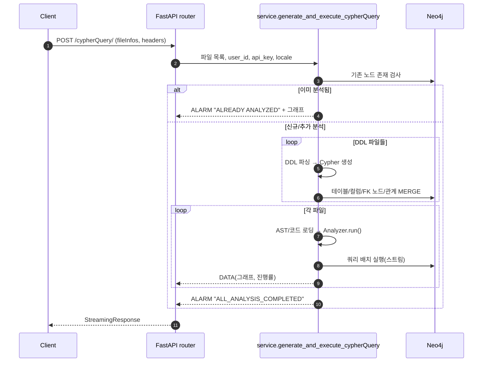
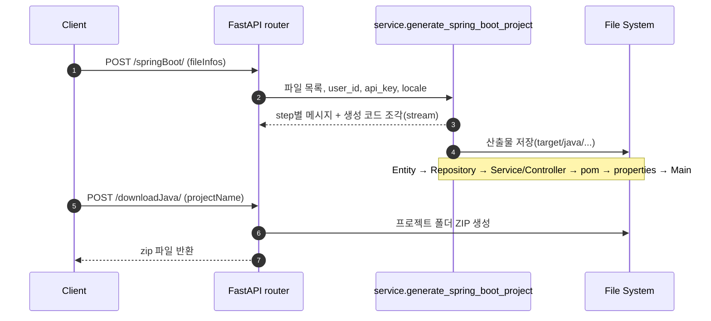
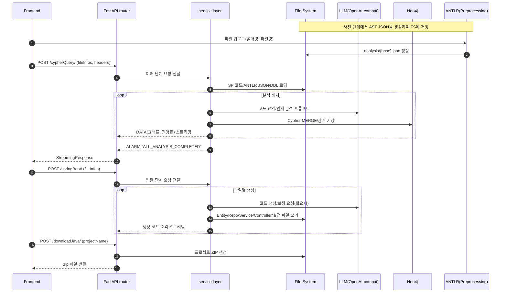

## Legacy Modernizer Backend

이 프로젝트는 기존 PL/SQL(또는 유사 SP 코드)을 분석해 그래프(Neo4j)로 이해 관계를 구성하고, 그 결과를 바탕으로 스프링 부트(Java) 프로젝트로 변환하는 백엔드입니다. 핵심은 다음 두 단계입니다.

- 이해(Understanding): ANTLR로부터 얻은 구문 트리(JSON)와 원본 SP 코드를 함께 해석해, 프로시저/함수/문(statement)/테이블/컬럼/변수 등의 관계를 Neo4j에 저장합니다.
- 변환(Converting): 이해 단계 결과와 원본 코드를 바탕으로, 엔티티/리포지토리/서비스/컨트롤러/설정 파일 등을 생성해 스프링 부트 프로젝트를 만듭니다.


### 왜 그래프(Neo4j)인가?
절차형 코드에서 데이터 흐름과 호출 관계는 복잡합니다. 그래프 모델은 “무엇이 무엇과 연결되는가?”를 직관적으로 저장/탐색할 수 있어, 변환 과정에서 참조/의존/흐름을 쉽게 재구성할 수 있습니다.


## 디렉터리 구조와 주요 파일 설명

- `main.py`
  - 역할: FastAPI 앱 시작점. CORS 설정, 라우터 등록, 헬스체크(`/`).
  - 입력/출력: 없음(서버 부팅). `service.router`를 앱에 포함.

- `Dockerfile`
  - 역할: 컨테이너 빌드 정의.

- `requirements.txt`, `Pipfile*`
  - 역할: 파이썬 의존성 정의/관리.

- `service/`
  - `router.py`
    - 역할: HTTP 엔드포인트 집합.
    - 입력: 헤더(`Session-UUID`, `OpenAI-Api-Key|Anthropic-Api-Key`, `Accept-Language`), 바디(`fileInfos`).
    - 출력: 스트리밍(JSON+`send_stream`), 파일 다운로드.
    - 핵심 호출: `generate_and_execute_cypherQuery`, `generate_spring_boot_project`, `process_project_zipping`, `delete_all_temp_data`, `validate_anthropic_api_key`.
  - `service.py`
    - 역할: 이해/변환 파이프라인 구현.
    - 이해 단계 흐름: DDL 파일 스캔→`process_ddl_and_table_nodes`→파일별 `_run_understanding`(Analyzer 구동)→Neo4j MERGE→그래프 스트림→사후처리(`postprocess_table_variables`).
    - 변환 단계 흐름: 프로젝트명 생성→Entity→Repository→Service/Controller→pom/properties/Main 생성 스트림→`target/java/...` 저장.
    - 보조: ZIP 압축(`process_project_zipping`), 세션 정리(`delete_all_temp_data`), 키 검증(`validate_anthropic_api_key`).

- `understand/`
  - `analysis.py`
    - 역할: `Analyzer`가 AST를 DFS 순회, 코드 요약/토큰 관리, LLM 분석 호출, Cypher 쿼리 생성, 큐로 단계 이벤트 전달.
    - 입력: ANTLR JSON, 라인 넘버 포함 원문 코드, 세션/파일 메타.
    - 출력: Cypher 리스트(노드/관계 MERGE), 진행률/라인 정보 이벤트.
  - `neo4j_connection.py`
    - 역할: Neo4j 비동기 드라이버 래퍼.
    - 기능: 다중 쿼리 실행(`execute_queries`), 그래프 객체 조회(`execute_query_and_return_graph`), 노드 존재 확인(`node_exists`).

- `convert/`
  - 역할: 스프링 부트 산출물 생성기.
  - 파일별 요약: `create_entity.py`(엔티티), `create_repository.py`(리포지토리), `create_service_skeleton.py`(서비스 뼈대), `create_service_preprocessing.py`(전처리/변수·시퀀스/쿼리 결합), `create_service_postprocessing.py`(최종 서비스 코드), `create_controller_skeleton.py`·`create_controller.py`(컨트롤러), `create_main.py`(메인), `create_properties.py`(설정), `create_pomxml.py`(빌드).

- `prompt/`
  - 역할: LLM 프롬프트/도우미.
  - 구성: `understand_ddl.py`(DDL 해석), `understand_prompt.py`/`understand_summarized_prompt.py`(코드 이해/요약), `understand_column_prompt.py`(컬럼 역할), `understand_variables_prompt.py`(변수), `convert_*_prompt.py`(변환 보조).

- `util/`
  - `utility_tool.py`: 라인 번호 부여, 토큰 계산, 테이블 식별자 파싱 등 핵심 유틸.
  - `llm_client.py`: OpenAI 호환 Chat/REST 클라이언트 생성 및 설정.
  - `exception.py`: 도메인별 예외 정의.

- `test/`
  - `test_understanding.py`: 이해 파이프라인 단위/통합 테스트.
  - `test_converting/`: 변환 단계 테스트 모듈 모음.
  - 기타: 테스트 헬퍼/샘플 데이터.


## 전체 흐름(한눈에 보기)

```mermaid
flowchart LR
  A[프론트 업로드\n(원본 SP/DDL)] --> B[ANTLR 사전 분석\n(AST JSON 생성)]
  B --> C[/POST /cypherQuery/]
  C --> D[이해 단계 실행\n- AST 순회/요약\n- LLM 분석\n- Cypher 생성/실행]
  D --> E[(Neo4j 그래프)]
  E --> F[사후처리\n- 변수 타입 보정\n- 컬럼 역할/테이블 설명]
  F --> G[/POST /springBoot/]
  G --> H[변환 단계\n- Entity/Repo/Service/Controller\n- pom/properties/Main]
  H --> I[파일 시스템 산출물]
  I --> J[/POST /downloadJava/ ZIP]
```

### 외부 서비스 통신 구조(Frontend/ANTLR/Neo4j/LLM)

```mermaid
flowchart LR
  subgraph Preprocessing[사전 단계]
    FE[Frontend(Web/App)] -->|파일 업로드| ANTLR[ANTLR 파서]
    ANTLR -->|AST JSON 생성| FS[(파일시스템)]
  end

  FE[Frontend(Web/App)] <--> API[FastAPI Backend]
  API <--> N4J[(Neo4j)]
  API <--> LLM[LLM(OpenAI\-compatible)]
  API -->|SP 코드/ANTLR JSON/DDL 읽기| FS
```

설명
- **ANTLR**: 런타임 호출이 아니라, 사전 파싱을 통해 `analysis/*.json` 파일을 생성합니다. 백엔드는 해당 JSON과 원본 파일을 읽습니다.
- **Frontend**: 스트리밍 응답을 받습니다. 청크 끝 토큰 `send_stream` 기준으로 분리해 처리하세요.
- **Neo4j**: Cypher로 노드/관계를 MERGE하고, 화면 표시용 그래프를 조회합니다.
- **LLM**: OpenAI 호환 엔드포인트를 사용합니다. 환경변수(`LLM_API_BASE`, `LLM_API_KEY`, `LLM_MODEL`)로 설정합니다.

### 시퀀스 다이어그램: 이해 단계(`/cypherQuery/`)




### 시퀀스 다이어그램: 변환 단계(`/springBoot/` → `/downloadJava/`)



### 엔드투엔드 시퀀스(Frontend 포함)



## 동작 원리(쉽게 설명)

- 입력 준비
  - ANTLR가 만든 구문 트리(JSON)와 원본 SP 코드를 세션별 폴더에 둡니다.
  - DDL(SQL)도 있으면 함께 둡니다. 테이블/컬럼 메타 구성을 도와줍니다.

- 이해 단계
  - 파일을 한 줄씩 따라가며 “이 구문은 무엇을 하나?”를 요약합니다.
  - LLM이 요약을 돕고, 테이블을 읽는지(SELECT), 쓰는지(INSERT/UPDATE/DELETE), 호출하는지(CALL) 등의 관계를 뽑아냅니다.
  - 이 정보를 Cypher 쿼리로 만들어 Neo4j에 저장합니다.
  - 마지막에 변수 타입(DDL 메타 참고)과 컬럼의 역할(예: 키/상태/금액 등 설명)을 보완합니다.

- 변환 단계
  - 이해 결과와 원본 코드를 바탕으로, Java 코드 뼈대와 실제 메서드 로직을 생성합니다.
  - 순서대로 Entity → Repository → Service/Controller → pom.xml → application.properties → Main 클래스를 만듭니다.


## 데이터/폴더 레이아웃(세션 기준)

- 기본 루트: `BASE_DIR = DOCKER_COMPOSE_CONTEXT || (프로젝트 상위)`
- 세션 폴더: `BASE_DIR/data/{Session-UUID}/`
  - `src/{folderName}/{fileName}`: 원본 SP 코드
  - `analysis/{baseName}.json`: ANTLR 구문 트리(JSON)
  - `ddl/*.sql`: DDL 스크립트
- 변환 산출물: `BASE_DIR/target/java/{Session-UUID}/{projectName}/...`
- ZIP 출력: `BASE_DIR/data/{Session-UUID}/zipfile/{projectName}.zip` (또는 컨텍스트에 따라 유사 경로)

### 업로드 단계(요약)
- 프론트는 파일 업로드 후(폴더명, 파일명) 서버 또는 별도 파이프라인에서 ANTLR을 실행해 `analysis/{base}.json`을 생성합니다.
- 그 후 `/cypherQuery/` 호출 시 `fileInfos`에는 업로드 시 사용한 `folderName`, `fileName`을 그대로 전달합니다.

### 분석 디렉터리 구조(그림)

```mermaid
flowchart TB
  classDef dir fill:#eef,stroke:#3b82f6,stroke-width:1px,color:#111
  classDef file fill:#fff,stroke:#94a3b8,stroke-dasharray: 3 2,color:#111
  classDef label fill:transparent,stroke:transparent,color:#334155

  subgraph DATA_ROOT[📁 BASE_DIR/data/{Session-UUID}]
    direction TB
    SRC[📂 src/]:::dir
    ANA[📂 analysis/]:::dir
    DDL[📂 ddl/]:::dir

    subgraph SRC_DIR[ ]
      direction TB
      SRC_FILE[📄 {folderName}/{fileName}]:::file
    end

    subgraph ANA_DIR[ ]
      direction TB
      ANA_FILE[🧩 {baseName}.json]:::file
    end

    subgraph DDL_DIR[ ]
      direction TB
      DDL_FILE[🗄️ *.sql]:::file
    end
  end

  note over SRC_DIR,ANA_DIR: {baseName} = fileName의 확장자 제외 이름
```

## API 요약

- 공통 헤더
  - `Session-UUID`: 세션 식별자(필수)
  - `OpenAI-Api-Key` 또는 `Anthropic-Api-Key`: 일반 세션 필수
    - 테스트 세션(`EN_TestSession`, `KO_TestSession`)은 환경변수 `LLM_API_KEY` 또는 `API_KEY` 사용
  - `Accept-Language`: 기본 `ko`

- `POST /cypherQuery/`
  - 목적: 이해 단계 실행, 그래프/진행률을 스트리밍으로 반환
  - 전제: 프론트가 업로드한 원본 파일과 ANTLR AST JSON이 해당 세션 디렉터리에 존재
  - 본문 예시:
    ```json
    {
      "fileInfos": [
        { "folderName": "PKG_ORDER", "fileName": "ORDER_PKG.sql" },
        { "folderName": "PKG_USER",  "fileName": "USER_PKG.sql" }
      ]
    }
    ```

- `POST /springBoot/`
  - 목적: 변환 단계 실행, 생성 코드 조각과 메시지를 스트리밍으로 반환
  - 본문: `/cypherQuery/`와 동일 형식의 `fileInfos`

- `POST /downloadJava/`
  - 목적: 생성된 스프링 부트 프로젝트 ZIP 다운로드
  - 본문 예시: `{ "projectName": "OrderSystem" }`

- `DELETE /deleteAll/`
  - 목적: 현재 세션의 임시 폴더 및 Neo4j 데이터 초기화

## 요청/스트리밍 응답 형식(계약)

- 공통 헤더
  - `Session-UUID`: 세션 ID(필수)
  - `Accept-Language`: `ko`(기본) 또는 `en`
  - `OpenAI-Api-Key` 또는 `Anthropic-Api-Key`: 테스트 세션 제외 시 필수

- 요청 바디(공통)
  ```json
  {
    "fileInfos": [
      { "folderName": "PKG_ORDER", "fileName": "ORDER_PKG.sql" },
      { "folderName": "PKG_USER",  "fileName": "USER_PKG.sql" }
    ]
  }
  ```

- 스트리밍 청크 구분자
  - 모든 스트리밍 응답은 각 JSON 청크 끝에 문자열 토큰 `send_stream`가 붙습니다.
  - 예시(raw 청크):
    ```json
    {"type":"ALARM","MESSAGE":"Preparing Analysis Data"}send_stream
    {"type":"DATA","graph":{...},"analysis_progress":42}send_stream
    ```

### 프론트엔드 스트리밍 파싱 가이드(중요)

- 모든 스트리밍 응답은 각 JSON 청크 끝에 문자열 토큰 `send_stream`가 붙습니다.
- EventSource가 아닌 일반 HTTP 스트림을 사용할 경우, 버퍼 문자열을 `send_stream` 기준으로 분리해 JSON.parse 하세요.
```javascript
let buffer = "";
response.body.on('data', (chunk) => {
  buffer += chunk.toString('utf-8');
  const parts = buffer.split('send_stream');
  buffer = parts.pop();
  for (const jsonText of parts) {
    if (!jsonText.trim()) continue;
    const payload = JSON.parse(jsonText);
    // payload.type === 'ALARM' | 'DATA' | payload.data_type === 'message'|'data'|'Done'
  }
});
```

- `/cypherQuery/` 스트리밍 청크(대표 필드)
  - ALARM: `{ "type": "ALARM", "MESSAGE": string, ... }`
  - DATA: `{ "type": "DATA", "graph": GraphObject, "line_number": int, "analysis_progress": 0-100, "current_file": "folder-file" }`
  - 오류: `{ "error": string }`

  - `GraphObject`(요약):
    ```json
    {
      "Nodes": [
        { "Node ID": "n1", "Labels": ["SELECT"], "Properties": {"startLine": 30, "file_name": "ORDER_PKG.sql", "user_id": "..."} }
      ],
      "Relationships": [
        { "Relationship ID": "r1", "Type": "FROM", "Start Node ID": "n1", "End Node ID": "nT", "Properties": {} }
      ]
    }
    ```

- `/springBoot/` 스트리밍 청크(대표 필드)
  - 메시지: `{ "data_type": "message", "step": number, "content": string }`
  - 생성 코드: `{ "data_type": "data", "file_type": "entity_class|repository_class|service_class|controller_class|pom|properties|main|command_class", "file_name": string, "code": string }`
  - 완료 표시: `{ "data_type": "Done", "step": number }` 또는 최종 `{ "data_type": "Done" }`

- `/downloadJava/` 응답
  - 본문: zip 바이너리(`application/octet-stream`)
  - 파일명: `projectName.zip`

- 상태 코드
  - 400: 잘못된 요청(세션/입력 누락 등)
  - 401: API 키 누락/검증 실패(일반 세션)
  - 500: 처리 중 서버 오류


## 그래프 데이터 모델(요약)

```mermaid
flowchart LR
  A[입력 파일 배치\n(ANTLR JSON, SP 코드, DDL)] --> B[/POST /cypherQuery/]
  B --> C[이해 단계 실행\n- AST 순회/요약\n- LLM 분석\n- Cypher 생성/실행]
  C --> D[(Neo4j 그래프)]
  D --> E[사후처리\n- 변수 타입 보정\n- 컬럼 역할/테이블 설명]
  E --> F[/POST /springBoot/]
  F --> G[변환 단계\n- Entity/Repo/Service/Controller\n- pom/properties/Main]
  G --> H[파일 시스템 산출물]
  H --> I[/POST /downloadJava/ ZIP]
```

### 빠른 시작(로컬)

1) 의존성 설치

- pip
  ```bash
  pip install -r requirements.txt
  ```
- 또는 Pipenv
  ```bash
  pipenv install --dev
  pipenv shell
  ```

Pipenv 환경에서 바로 실행/테스트(셸 진입 없이)
```bash
pipenv run uvicorn main:app --host 0.0.0.0 --port 5502 --reload
pipenv run pytest -q
```

2) 필수 환경변수

- Neo4j
  - `NEO4J_URI` (기본 `bolt://localhost:7687`)
  - `NEO4J_USER` (기본 `neo4j`)
  - `NEO4J_PASSWORD` (기본 `an1021402`)
- LLM 키
  - 일반 세션: 요청 헤더 `OpenAI-Api-Key` 또는 `Anthropic-Api-Key`
  - 테스트 세션: `.env` 혹은 환경에 `LLM_API_KEY` 또는 `API_KEY`

`.env` 예시(루트, FastAPI가 자동 로드)
```dotenv
NEO4J_URI=bolt://localhost:7687
NEO4J_USER=neo4j
NEO4J_PASSWORD=neo4j
# 참고: 위 값은 개발 기본값입니다. 운영 환경에서는 반드시 변경하세요.

# OpenAI-호환 LLM 설정
LLM_API_BASE=https://api.openai.com/v1
LLM_API_KEY=sk-...
LLM_MODEL=gpt-5-mini
LLM_MAX_TOKENS=32768
```

3) 서버 실행

```bash
python main.py
# 또는
uvicorn main:app --host 0.0.0.0 --port 5502 --reload
```

Pipenv 셸에서 실행(권장)
```bash
pipenv shell
uvicorn main:app --host 0.0.0.0 --port 5502 --reload
```

4) 입력 파일 배치

```text
BASE_DIR/
  data/{Session-UUID}/
    src/{folderName}/{fileName}
    analysis/{baseName}.json
    ddl/*.sql (선택)
```

5) 예시 호출(curl)

```bash
curl -N -X POST "http://localhost:5502/cypherQuery/" \
  -H "Content-Type: application/json" \
  -H "Session-UUID: KO_TestSession" \
  -d "{\"fileInfos\":[{\"folderName\":\"PKG_ORDER\",\"fileName\":\"ORDER_PKG.sql\"}]}"

curl -N -X POST "http://localhost:5502/springBoot/" \
  -H "Content-Type: application/json" \
  -H "Session-UUID: KO_TestSession" \
  -d "{\"fileInfos\":[{\"folderName\":\"PKG_ORDER\",\"fileName\":\"ORDER_PKG.sql\"}]}"

curl -X POST "http://localhost:5502/downloadJava/" \
  -H "Content-Type: application/json" \
  -H "Session-UUID: KO_TestSession" \
  -d "{\"projectName\":\"OrderSystem\"}" --output OrderSystem.zip
```


## 테스트

- 이해 단계: `test/test_understanding.py`
- 변환 단계: `test/test_converting/` 폴더의 테스트들
- 실행 예시
  ```bash
  python -m pytest -q
  ```


## 주의사항

- 세션별 폴더 구조를 지켜 주세요. 파일명은 요청의 `fileInfos`와 정확히 일치해야 합니다.
- DDL가 있을 경우 컬럼 타입/관계가 더 정확해집니다.
- 스트리밍 응답은 청크 끝에 `send_stream` 토큰이 붙습니다. 클라이언트에서 이 경계를 기준으로 파싱하세요.


## 배경과 철학(아주 간단히)

- 사람 입장에서 이해하기 쉬운 “무엇이 무엇과 연결되었는가”를 먼저 만들고(그래프), 그 위에 코드 생성을 쌓습니다.
- 분석은 보수적으로 MERGE하고, 변환은 단계별로 결과를 공개하며 진행률을 알립니다.
- 어려운 용어 대신, “읽는다/쓴다/호출한다” 같은 말로 관계를 표현해 추적을 쉽게 합니다.


