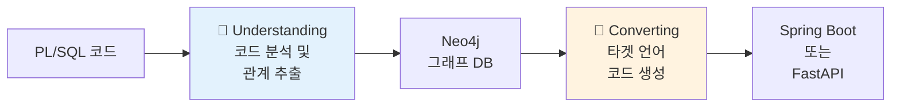

# 🔄 Legacy Modernizer Backend - Understanding 파이프라인 완벽 가이드

> **PL/SQL 코드를 이해하고 Neo4j 그래프로 변환하는 AI 기반 코드 분석 도구**

[](https://fastapi.tiangolo.com/)
[](https://www.python.org/)
[](https://neo4j.com/)
[](https://openai.com/)

---

## 📋 목차

- [프로젝트 개요](#-프로젝트-개요)
- [시작하기 전에](#-시작하기-전에)
- [프로젝트 구조 이해하기](#-프로젝트-구조-이해하기)
- [데이터 폴더 구조](#-데이터-폴더-구조)
- [Understanding 파이프라인 완벽 가이드](#-understanding-파이프라인-완벽-가이드)
- [시퀀스 다이어그램](#-시퀀스-다이어그램)
- [개발 환경 설정](#-개발 환경-설정)
- [테스트 실행 가이드](#-테스트-실행-가이드)
- [Neo4j 활용 가이드](#-neo4j-활용-가이드)
- [파일별 상세 가이드](#-파일별-상세-가이드)
- [트러블슈팅](#-트러블슈팅)

---

## 🎯 프로젝트 개요

### Legacy Modernizer란?

Legacy Modernizer는 **오래된 PL/SQL 저장 프로시저를 현대적인 Java Spring Boot 또는 Python FastAPI 프로젝트로 자동 변환**하는 AI 기반 도구입니다.

### 핵심 철학

```
┌─────────────────────────────────────────────────────────────┐
│  "코드는 단순한 텍스트가 아니라 관계의 집합이다"             │
│                                                               │
│  PL/SQL의 복잡한 의존성과 호출 관계를 그래프로 표현하여      │
│  AI가 맥락을 이해하고 정확한 변환을 수행하도록 돕는다        │
└─────────────────────────────────────────────────────────────┘
```

### 왜 두 단계로 나누었나?

Legacy Modernizer는 **Understanding**(이해)과 **Converting**(변환) 두 단계로 명확히 분리되어 있습니다.



**이렇게 분리한 이유:**

1. **관심사의 분리**: 
   - Understanding은 "무엇을 하는가?"에 집중
   - Converting은 "어떻게 표현하는가?"에 집중

2. **재사용성**:
   - 한 번 분석한 그래프는 Java, Python, TypeScript 등 여러 언어로 변환 가능
   - 분석 결과를 캐싱하여 반복 변환 시 빠른 응답

3. **디버깅 용이성**:
   - 변환 결과가 이상하다면 → Converting 단계 문제
   - 관계가 누락되었다면 → Understanding 단계 문제
   - 문제 범위를 명확히 격리 가능

4. **확장성**:
   - 새로운 타겟 언어 추가 시 Converting만 수정
   - Understanding 로직은 건드리지 않음

---

## 🚀 시작하기 전에

### 필수 사전 지식

이 문서를 완전히 이해하려면 다음 개념에 익숙해야 합니다:

- ✅ **Python 비동기 프로그래밍**: `async/await`, `asyncio.Queue`, `asyncio.gather`
- ✅ **AST (Abstract Syntax Tree)**: 추상 구문 트리의 개념
- ✅ **그래프 데이터베이스**: 노드, 관계, 경로 탐색
- ✅ **LLM 프롬프트 엔지니어링**: 컨텍스트 윈도우, 토큰 제한
- ✅ **Neo4j Cypher 쿼리**: 기본적인 MATCH, CREATE, MERGE 구문

### 설치 요구사항

| 항목 | 버전 | 필수 여부 | 용도 |
|------|------|----------|------|
| **Python** | 3.10+ | ✅ | 백엔드 실행 환경 |
| **Neo4j** | 5.x | ✅ | 그래프 데이터베이스 |
| **ANTLR 서버** | - | ✅ | PL/SQL 파싱 (별도 서버) |
| **LLM API 키** | - | ✅ | OpenAI 호환 API |
| **uv 또는 pipenv** | latest | ✅ | 의존성 관리 |

### 빠른 시작

```bash
# 1. 저장소 클론
git clone <repository-url>
cd backend

# 2. 가상 환경 및 의존성 설치
uv venv
source .venv/Scripts/activate  # Windows
uv pip install -r requirements.txt

# 3. 환경 변수 설정
cat > .env << EOF
NEO4J_URI=bolt://localhost:7687
NEO4J_USER=neo4j
NEO4J_PASSWORD=your-password

LLM_API_BASE=https://api.openai.com/v1
LLM_API_KEY=sk-your-key
LLM_MODEL=gpt-4-turbo
EOF

# 4. 서버 실행
python main.py
```

서버가 정상적으로 시작되면 `http://localhost:5502` 에서 API 문서를 확인할 수 있습니다.

---

## 📂 프로젝트 구조 이해하기

### 디렉터리 구조 전체 개요

```
backend/
├── 📄 main.py                          # FastAPI 진입점
├── 📄 requirements.txt                 # Python 의존성
├── 📄 .env                             # 환경 변수 (Git 제외)
│
├── 📁 service/                         # API 레이어
│   ├── router.py                       # 엔드포인트 정의
│   └── service.py                      # 오케스트레이션 로직
│
├── 📁 understand/                      # 🎯 Understanding 파이프라인 (핵심!)
│   ├── analysis.py                     # Analyzer 클래스 (리팩터 버전)
│   └── neo4j_connection.py             # Neo4j 연결 관리
│
├── 📁 legacy/                          # 레거시 코드 (비교용)
│   └── understand/
│       └── analysis.py                 # 구버전 Analyzer
│
├── 📁 prompt/                          # LLM 프롬프트 정의
│   ├── understand_prompt.py            # 일반 코드 분석
│   ├── understand_dml_table_prompt.py  # DML 테이블 추출
│   ├── understand_table_summary_prompt.py  # 테이블 요약
│   ├── understand_summarized_prompt.py # 프로시저 요약
│   ├── understand_variables_prompt.py  # 변수 분석
│   ├── understand_column_prompt.py     # 컬럼 역할 분석
│   └── understand_ddl.py               # DDL 분석
│
├── 📁 util/                            # 유틸리티
│   ├── utility_tool.py                 # 공통 함수
│   ├── llm_client.py                   # LLM API 클라이언트
│   ├── rule_loader.py                  # YAML 규칙 로더
│   └── exception.py                    # 커스텀 예외
│
├── 📁 convert/                         # Converting 단계 (별도 문서)
├── 📁 rules/                           # Converting 규칙 (YAML)
│
└── 📁 test/                            # 테스트 코드
    ├── conftest.py                     # pytest 설정
    ├── test_understanding.py           # Understanding 테스트
    └── test_converting.py              # Converting 테스트
```

### 모듈별 역할 요약

#### 1️⃣ **service/** - API 계층

**역할**: 프론트엔드 요청을 받아 Understanding/Converting 파이프라인을 실행하고 스트리밍 응답을 반환합니다.

**주요 파일**:
- `router.py`: FastAPI 엔드포인트 정의 (`/cypherQuery/`, `/springBoot/` 등)
- `service.py`: `ServiceOrchestrator` 클래스로 전체 파이프라인 조율

**핵심 메서드**:
```python
class ServiceOrchestrator:
    async def understand_project(file_names) -> AsyncGenerator
    async def convert_to_springboot(file_names) -> AsyncGenerator
    async def validate_api_key()
    async def cleanup_all_data()
```

#### 2️⃣ **understand/** - Understanding 파이프라인 (🎯 이 문서의 핵심)

**역할**: PL/SQL 코드를 AST 기반으로 분석하고, LLM을 활용하여 의미를 추출한 후 Neo4j 그래프로 저장합니다.

**주요 파일**:
- `analysis.py`: **핵심 분석 엔진** (1300줄 이상)
  - `Analyzer`: 메인 오케스트레이터
  - `StatementCollector`: AST 평탄화
  - `BatchPlanner`: 토큰 기반 배치 생성
  - `LLMInvoker`: 병렬 LLM 호출
  - `ApplyManager`: 결과 순차 적용

- `neo4j_connection.py`: Neo4j 드라이버 래퍼
  - 비동기 연결 관리
  - 쿼리 실행 및 그래프 반환

**핵심 클래스 관계**:
```
Analyzer (진입점)
  └─> StatementCollector (AST 평탄화)
        └─> List[StatementNode]
              └─> BatchPlanner (배치 생성)
                    └─> List[AnalysisBatch]
                          └─> LLMInvoker (병렬 호출)
                                └─> ApplyManager (순차 적용)
                                      └─> Neo4j 저장
```

#### 3️⃣ **prompt/** - LLM 프롬프트 정의

**역할**: Understanding 단계에서 사용하는 모든 프롬프트를 Python 함수로 정의합니다.

**파일별 용도**:

| 파일 | 프롬프트 대상 | 입력 | 출력 | 호출 시점 |
|------|-------------|------|------|----------|
| `understand_prompt.py` | 일반 코드 구문 | SP 코드, 라인 범위 | summary, variables, calls | 배치 단위 |
| `understand_dml_table_prompt.py` | DML 구문 | DML 코드, 라인 범위 | 테이블, 컬럼, FK, DBLink | 배치 내 DML 존재 시 |
| `understand_table_summary_prompt.py` | 테이블/컬럼 설명 | 누적된 설명 문장들 | 최종 요약 | 파일 분석 완료 후 |
| `understand_summarized_prompt.py` | 프로시저 전체 | 자식 노드 요약 모음 | 프로시저 요약 | 프로시저 분석 완료 후 |
| `understand_variables_prompt.py` | 변수 선언부 | SPEC/DECLARE 코드 | 변수 목록, 타입, 역할 | 정적 그래프 초기화 시 |
| `understand_column_prompt.py` | 컬럼 역할 | 컬럼 목록, DML 요약 | 컬럼별 역할 설명 | 파일 후처리 시 |
| `understand_ddl.py` | DDL 파일 | CREATE TABLE 구문 | 테이블, 컬럼, PK, FK | 파일 분석 전 |

**프롬프트 설계 철학**:
- **작고 명확한 책임**: 각 프롬프트는 하나의 분석 목적만 수행
- **JSON 출력 강제**: `JsonOutputParser`로 구조화된 결과 보장
- **예제 기반 학습**: Few-shot 예제로 출력 형식 가이드

#### 4️⃣ **util/** - 유틸리티

**utility_tool.py 주요 함수**:

```python
# 토큰 계산
calculate_code_token(code: str) -> int

# 스네이크 케이스 변환
convert_to_pascal_case(text: str) -> str
convert_to_camel_case(text: str) -> str

# 테이블 식별자 파싱
parse_table_identifier(identifier: str) -> Tuple[schema, table, dblink]

# Cypher 이스케이프
escape_for_cypher(text: str) -> str

# 라인 번호 추가
add_line_numbers(lines: List[str]) -> Tuple[str, int]

# 스트리밍 응답 생성
emit_message(content: Any) -> bytes
emit_data(**kwargs) -> bytes
emit_error(message: str) -> bytes
```

**llm_client.py**:
```python
def get_llm(api_key: str = None, model: str = None) -> ChatOpenAI:
    """
    LangChain ChatOpenAI 클라이언트 생성
    - 환경 변수에서 API 키/모델 읽기
    - 기본 모델: gpt-4-turbo
    - 캐싱 활성화 (langchain.db)
    """
```

#### 5️⃣ **test/** - 테스트 코드

**test_understanding.py**:
- 환경 변수 `UNDERSTANDING_VARIANT`로 레거시/리팩터 버전 선택
- 실제 Neo4j와 LLM API를 사용한 통합 테스트
- 성능 비교 및 결과 검증

---

## 📦 데이터 폴더 구조

Understanding 파이프라인이 정상 동작하려면 **정확한 파일 경로 규칙**을 준수해야 합니다.

### 기본 구조

```
BASE_DIR/  (환경 변수 DOCKER_COMPOSE_CONTEXT 또는 프로젝트 루트)
│
├── data/                               # 입력 데이터 디렉터리
│   └── {user_id}/                      # 사용자(세션) 식별자
│       └── {project_name}/             # 프로젝트 이름
│           ├── src/                    # 📄 원본 PL/SQL 파일
│           │   └── {folder_name}/      # 폴더(패키지) 이름
│           │       └── {file_name}.sql
│           │
│           ├── analysis/               # 📊 ANTLR 파싱 결과 (JSON)
│           │   └── {folder_name}/
│           │       └── {base_name}.json
│           │
│           └── ddl/                    # 📋 DDL 파일 (선택)
│               └── *.sql
│
└── target/                             # 출력 디렉터리 (Converting 단계)
    └── java/
        └── {user_id}/
            └── {project_name}/
                └── (생성된 Spring Boot 프로젝트)
```

### 경로 예시

프론트엔드에서 다음과 같은 요청을 보낸다고 가정합니다:

```json
{
  "projectName": "HOSPITAL_SYSTEM",
  "dbms": "oracle",
  "systems": [
    {
      "name": "PATIENT_PKG",
      "sp": ["SP_PATIENT_REGISTER.sql", "SP_PATIENT_UPDATE.sql"]
    }
  ]
}
```

그러면 Backend는 다음 경로에서 파일을 찾습니다:

```
data/
└── KO_TestSession/                     # 헤더 Session-UUID 값
    └── HOSPITAL_SYSTEM/                # 요청 바디 projectName
        ├── src/
        │   └── PATIENT_PKG/            # systems[0].name
        │       ├── SP_PATIENT_REGISTER.sql  # systems[0].sp[0]
        │       └── SP_PATIENT_UPDATE.sql    # systems[0].sp[1]
        │
        ├── analysis/
        │   └── PATIENT_PKG/
        │       ├── SP_PATIENT_REGISTER.json  # ANTLR 파싱 결과
        │       └── SP_PATIENT_UPDATE.json
        │
        └── ddl/
            └── DDL_PATIENT.sql         # DDL 파일 (있으면 먼저 처리)
```

### 파일 존재 여부 검증

`service.py`의 `_load_assets` 메서드가 파일을 로드할 때 다음 두 파일이 **반드시** 존재해야 합니다:

```python
# 원본 SP 파일
plsql_file_path = os.path.join(
    self.dirs['plsql'],      # data/{user_id}/{project_name}/src
    folder_name,             # PATIENT_PKG
    file_name                # SP_PATIENT_REGISTER.sql
)

# ANTLR JSON 파일
analysis_file_path = os.path.join(
    self.dirs['analysis'],   # data/{user_id}/{project_name}/analysis
    folder_name,             # PATIENT_PKG
    f"{base_name}.json"      # SP_PATIENT_REGISTER.json
)
```

만약 파일이 없으면 `FileNotFoundError`가 발생하며, 프론트엔드에 에러 응답이 전송됩니다.

### ANTLR JSON 구조

ANTLR 서버가 생성하는 JSON 파일은 다음 구조를 가집니다:

```json
{
  "type": "FILE",
  "startLine": 0,
  "endLine": 0,
  "children": [
    {
      "type": "PROCEDURE",
      "startLine": 1,
      "endLine": 95,
      "children": [
        {
          "type": "SPEC",
          "startLine": 1,
          "endLine": 13,
          "children": []
        },
        {
          "type": "DECLARE",
          "startLine": 14,
          "endLine": 20,
          "children": []
        },
        {
          "type": "SELECT",
          "startLine": 25,
          "endLine": 28,
          "children": []
        },
        {
          "type": "IF",
          "startLine": 30,
          "endLine": 50,
          "children": [
            {
              "type": "INSERT",
              "startLine": 32,
              "endLine": 35,
              "children": []
            }
          ]
        },
        {
          "type": "COMMIT",
          "startLine": 52,
          "endLine": 52,
          "children": []
        }
      ]
    }
  ]
}
```

**중요한 포인트**:

1. **트리 구조**: AST는 재귀적 트리 구조로, 부모 노드는 `children` 배열로 자식을 포함합니다.

2. **라인 범위**: 각 노드는 `startLine`과 `endLine`을 가지며, 원본 SP 코드에서 해당 범위를 추출할 수 있습니다.

3. **타입 다양성**: `FILE`, `PROCEDURE`, `FUNCTION`, `SELECT`, `INSERT`, `UPDATE`, `DELETE`, `IF`, `LOOP`, `FOR`, `ASSIGNMENT` 등 50가지 이상의 노드 타입이 존재합니다.

4. **그래프 매핑**: 이 JSON 구조 그대로 Neo4j 그래프가 생성됩니다. 예를 들어:
   ```
   (FILE)-[:PARENT_OF]->(PROCEDURE)-[:PARENT_OF]->(SELECT)
   ```

5. **리프 노드**: `children`이 빈 배열이면 리프 노드입니다. 리프 노드는 LLM 분석의 최소 단위가 됩니다.

### DDL 파일 구조

DDL 파일은 선택 사항이지만, 있으면 파일 분석 **전에** 먼저 처리됩니다.

**DDL 파일 예시** (`ddl/DDL_PATIENT.sql`):

```sql
CREATE TABLE TPJ_PATIENT (
    PATIENT_KEY NUMBER PRIMARY KEY,
    PATIENT_NAME VARCHAR2(100) NOT NULL,
    BIRTH_DATE DATE,
    GENDER CHAR(1),
    PHONE VARCHAR2(20)
);

CREATE TABLE TPJ_RECEPTION (
    RECEPT_KEY NUMBER PRIMARY KEY,
    PATIENT_KEY NUMBER NOT NULL,
    STATUS CHAR(1) DEFAULT 'W',
    CONSTRAINT FK_RECEPT_PATIENT FOREIGN KEY (PATIENT_KEY) REFERENCES TPJ_PATIENT(PATIENT_KEY)
);
```

**DDL 처리 결과**:
- Neo4j에 `Table` 노드와 `Column` 노드가 미리 생성됩니다.
- FK 관계도 `FK_TO_TABLE`, `FK_TO` 관계로 연결됩니다.
- 이후 DML 구문 분석 시 이미 존재하는 테이블에 연결됩니다.

---

## 📖 Understanding 파이프라인 완벽 가이드

이제 Understanding 파이프라인의 **모든 세부 동작**을 처음부터 끝까지 단계별로 설명합니다.

### 전체 흐름 개요

```
┌──────────────────────────────────────────────────────────────────────┐
│                     Understanding 파이프라인                          │
├──────────────────────────────────────────────────────────────────────┤
│                                                                        │
│  1️⃣ 사전 준비                                                        │
│     ├─ API 키 검증                                                    │
│     ├─ Neo4j 연결 확립                                                │
│     ├─ 이벤트 큐 생성                                                 │
│     └─ 프로젝트 폴더 존재 여부 확인                                   │
│                                                                        │
│  2️⃣ DDL 처리 (선택, 있으면 먼저 실행)                                │
│     ├─ ddl/*.sql 파일 목록 조회                                       │
│     ├─ 병렬 처리 (최대 5개 동시)                                      │
│     ├─ LLM으로 DDL 파싱                                               │
│     └─ Table, Column 노드 생성 + FK 관계 설정                         │
│                                                                        │
│  3️⃣ 파일별 분석 루프 (systems 배열 순회)                             │
│     │                                                                  │
│     ├─ 3-1. 파일 로딩                                                 │
│     │     ├─ 원본 SP 코드 읽기 (src/{folder}/{file})                 │
│     │     ├─ ANTLR JSON 읽기 (analysis/{folder}/{base}.json)         │
│     │     └─ 라인 번호 추가 (1: code, 2: code, ...)                  │
│     │                                                                  │
│     ├─ 3-2. Analyzer 초기화 및 실행                                   │
│     │     └─ Analyzer.run() 호출 → 비동기 작업 시작                  │
│     │                                                                  │
│     ├─ 3-3. AST 평탄화 (StatementCollector)                          │
│     │     ├─ 후위 순회 (DFS)로 모든 노드 수집                         │
│     │     ├─ 부모-자식 관계 메모리에 구축                             │
│     │     ├─ 프로시저 정보 추출 (이름, 스키마, 라인 범위)              │
│     │     └─ StatementNode 리스트 생성                                │
│     │                                                                  │
│     ├─ 3-4. 정적 그래프 초기화 (_initialize_static_graph)            │
│     │     ├─ 모든 노드 생성 (FILE, PROCEDURE, SELECT, ...)           │
│     │     ├─ PARENT_OF 관계 생성                                      │
│     │     ├─ NEXT 관계 생성 (형제 노드 간)                            │
│     │     └─ 변수 선언 노드 병렬 분석 (SPEC, DECLARE, PACKAGE_VAR)    │
│     │           ├─ LLM 호출 (최대 5개 동시)                           │
│     │           ├─ Variable 노드 생성                                 │
│     │           └─ SCOPE 관계 설정                                    │
│     │                                                                  │
│     ├─ 3-5. 배치 계획 (BatchPlanner)                                 │
│     │     ├─ analyzable 노드 필터링                                   │
│     │     ├─ 토큰 기반 배치 생성 (MAX_BATCH_TOKEN=1000)              │
│     │     ├─ 부모 노드는 자식 완료 후 단독 배치                       │
│     │     └─ AnalysisBatch 리스트 반환                                │
│     │                                                                  │
│     ├─ 3-6. 병렬 LLM 호출 (LLMInvoker + Worker Pool)                 │
│     │     ├─ 세마포어로 동시성 제어 (MAX_CONCURRENCY=5)               │
│     │     ├─ 부모 노드는 자식 completion_event 대기                   │
│     │     ├─ 배치마다 2개 프롬프트 호출:                               │
│     │     │   ├─ understand_code (일반 분석)                          │
│     │     │   └─ understand_dml_tables (DML 메타)                     │
│     │     └─ BatchResult 생성 후 ApplyManager 제출                    │
│     │                                                                  │
│     ├─ 3-7. 순차 적용 (ApplyManager)                                 │
│     │     ├─ 배치 ID 순서대로 적용 (순서 보장)                        │
│     │     ├─ 노드 summary 저장                                        │
│     │     ├─ 변수 사용 관계 (USED) 생성                               │
│     │     ├─ 프로시저 호출 관계 (CALL) 생성                           │
│     │     ├─ 테이블 관계 (FROM, WRITES) 생성                          │
│     │     ├─ Column 노드 생성                                         │
│     │     ├─ FK 관계 생성                                             │
│     │     ├─ DBLink 관계 생성                                         │
│     │     ├─ 프로시저 요약 누적 (자식 완료 시 LLM 최종 요약)          │
│     │     ├─ 테이블/컬럼 설명 누적 (파일 완료 시 LLM 최종 요약)       │
│     │     └─ Neo4j 저장 및 프론트엔드 스트리밍 응답                    │
│     │                                                                  │
│     ├─ 3-8. 후처리 (_postprocess_file)                               │
│     │     ├─ 변수 타입 보정 (DDL 참조)                                │
│     │     │   ├─ Variable 노드 조회                                   │
│     │     │   ├─ Table 메타 매칭                                      │
│     │     │   ├─ LLM으로 타입 해석                                    │
│     │     │   └─ Variable.type, resolved 업데이트                     │
│     │     └─ 컬럼 역할 산출                                           │
│     │           ├─ Table 및 Column 조회                               │
│     │           ├─ DML 요약 수집                                      │
│     │           ├─ LLM으로 역할 분석                                  │
│     │           └─ Column.description 업데이트                        │
│     │                                                                  │
│     └─ 3-9. 스트리밍 응답                                             │
│           ├─ 진행률 전송 (line_number, analysis_progress)            │
│           ├─ 그래프 데이터 전송 (Nodes, Relationships)                │
│           └─ 최종 완료 메시지                                         │
│                                                                        │
│  4️⃣ 완료                                                             │
│     └─ "ALL_ANALYSIS_COMPLETED" 메시지 전송                          │
│                                                                        │
└──────────────────────────────────────────────────────────────────────┘
```

---

### 단계별 상세 설명

#### 1️⃣ 사전 준비 단계

**위치**: `service/service.py` - `ServiceOrchestrator.understand_project()`

**목적**: Understanding 파이프라인 실행을 위한 환경을 준비합니다.

**세부 동작**:

```python
async def understand_project(self, file_names: list) -> AsyncGenerator[bytes, None]:
    """
    file_names: [(folder_name, file_name), ...] 형식의 리스트
    예: [("PATIENT_PKG", "SP_PATIENT_REGISTER.sql")]
    """
    # 1. Neo4j 연결 생성
    connection = Neo4jConnection()
    
    # 2. 이벤트 큐 생성 (Analyzer와 통신용)
    events_from_analyzer = asyncio.Queue()  # Analyzer → Service
    events_to_analyzer = asyncio.Queue()    # Service → Analyzer
    
    try:
        # 3. 준비 메시지 전송
        yield emit_message("Preparing Analysis Data")
        
        # 4. 이미 분석된 경우 캐시 반환
        if await connection.node_exists(self.user_id, file_names):
            yield emit_message("ALREADY ANALYZED")
            graph_data = await connection.execute_query_and_return_graph(
                self.user_id, file_names
            )
            yield emit_data(graph=graph_data, analysis_progress=100)
            return
        
        # 다음 단계로 계속...
```

**이벤트 큐의 역할**:

```
┌─────────────┐                    ┌─────────────┐
│  Service    │                    │  Analyzer   │
│ (Orchestr.) │                    │   (Worker)  │
└─────────────┘                    └─────────────┘
       │                                  │
       │  events_from_analyzer            │
       │◄─────────────────────────────────│
       │  {"type": "analysis_code",       │
       │   "query_data": [...],           │
       │   "line_number": 45}             │
       │                                  │
       │  events_to_analyzer              │
       │──────────────────────────────────►│
       │  {"type": "process_completed"}   │
       │                                  │
```

**이벤트 타입**:

| 방향 | 타입 | 내용 | 목적 |
|------|------|------|------|
| Analyzer → Service | `analysis_code` | Cypher 쿼리, 진행 라인 | Neo4j 저장 요청 |
| Analyzer → Service | `end_analysis` | - | 파일 분석 완료 신호 |
| Analyzer → Service | `error` | 에러 메시지 | 예외 발생 알림 |
| Service → Analyzer | `process_completed` | - | 저장 완료 확인 |

---

#### 2️⃣ DDL 처리 단계

**위치**: `service/service.py` - `_process_ddl()`

**목적**: DDL 파일이 있으면 먼저 처리하여 Table/Column 노드를 미리 생성합니다.

**왜 먼저 처리하나요?**

```
시나리오 1: DDL이 없는 경우
├─ DML 구문 분석 시 테이블 발견
├─ "Table: TPJ_PATIENT" 노드만 생성 (컬럼 정보 없음)
└─ 후처리에서 수동으로 컬럼 추론 필요 (부정확)

시나리오 2: DDL이 있는 경우
├─ DDL에서 정확한 스키마 파악
│   ├─ 테이블 이름, 컬럼 이름, 데이터 타입
│   ├─ Primary Key, Foreign Key
│   └─ NOT NULL, DEFAULT 값
├─ DML 구문 분석 시 기존 노드에 연결
└─ 정확하고 완전한 메타데이터 보장
```

**세부 동작**:

```python
# 1. DDL 파일 목록 조회
ddl_files = self._list_ddl_files()  # ['DDL_PATIENT.sql', 'DDL_RECEPTION.sql']

if ddl_files:
    # 2. 병렬 처리 준비 (세마포어로 동시성 제어)
    ddl_semaphore = asyncio.Semaphore(DDL_MAX_CONCURRENCY)  # 최대 5개 동시
    ddl_tasks = []
    
    async def _run_single_ddl(file_name: str):
        async with ddl_semaphore:
            ddl_file_path = os.path.join(self.dirs['ddl'], file_name)
            await self._process_ddl(ddl_file_path, connection, file_name)
    
    # 3. 모든 DDL 파일 병렬 처리
    for ddl_file_name in ddl_files:
        yield emit_message(f"START DDL PROCESSING: {ddl_file_name}")
        ddl_tasks.append(asyncio.create_task(_run_single_ddl(ddl_file_name)))
    
    # 4. 모든 작업 완료 대기
    await asyncio.gather(*ddl_tasks)
```

**_process_ddl() 내부 로직**:

```python
async def _process_ddl(self, ddl_file_path: str, connection: Neo4jConnection, file_name: str):
    # 1. DDL 파일 읽기
    async with aiofiles.open(ddl_file_path, 'r', encoding='utf-8') as ddl_file:
        ddl_content = await ddl_file.read()
    
    # 2. LLM으로 DDL 파싱
    parsed = understand_ddl(ddl_content, self.api_key, self.locale)
    # 반환 형식:
    # {
    #   "analysis": [
    #     {
    #       "table": {"schema": "PUBLIC", "name": "TPJ_PATIENT", "comment": "환자 테이블"},
    #       "columns": [
    #         {"name": "PATIENT_KEY", "dtype": "NUMBER", "comment": "환자 ID", "nullable": false}
    #       ],
    #       "primaryKeys": ["PATIENT_KEY"],
    #       "foreignKeys": [{"column": "...", "ref": "..."}]
    #     }
    #   ]
    # }
    
    # 3. Cypher 쿼리 생성
    cypher_queries = []
    for table in parsed['analysis']:
        # 3-1. Table 노드 생성
        cypher_queries.append(f"""
            MERGE (t:Table {{
                user_id: '{self.user_id}',
                schema: '{schema}',
                name: '{table_name}',
                db: '{self.dbms}',
                project_name: '{self.project_name}'
            }})
            SET t.description = '{table_comment}',
                t.table_type = 'BASE TABLE'
        """)
        
        # 3-2. Column 노드 생성 (중복 방지를 위해 user_id + fqn + project_name으로 MERGE)
        for col in columns:
            fqn = f"{schema}.{table_name}.{col_name}".lower()
            cypher_queries.append(f"""
                MERGE (c:Column {{
                    user_id: '{self.user_id}',
                    fqn: '{fqn}',
                    project_name: '{self.project_name}'
                }})
                SET c.name = '{col_name}',
                    c.dtype = '{col_type}',
                    c.description = '{col_comment}',
                    c.nullable = '{nullable}',
                    c.pk_constraint = '{table_name}_pkey'  -- PK인 경우만
                
                WITH c
                MATCH (t:Table {{user_id: '{self.user_id}', name: '{table_name}'}})
                MERGE (t)-[:HAS_COLUMN]->(c)
            """)
        
        # 3-3. FK 관계 생성
        for fk in foreign_keys:
            cypher_queries.append(f"""
                MATCH (st:Table {{user_id: '{self.user_id}', name: '{source_table}'}})
                MATCH (tt:Table {{user_id: '{self.user_id}', name: '{target_table}'}})
                MERGE (st)-[:FK_TO_TABLE]->(tt)
                
                MATCH (sc:Column {{user_id: '{self.user_id}', name: '{source_column}', fqn: '{source_fqn}'}})
                MATCH (tc:Column {{user_id: '{self.user_id}', name: '{target_column}', fqn: '{target_fqn}'}})
                MERGE (sc)-[:FK_TO]->(tc)
            """)
    
    # 4. Neo4j 실행
    await connection.execute_queries(cypher_queries)
    logging.info(f"DDL 파일 처리 완료: {file_name}")
```

**생성되는 그래프 구조 (DDL 처리 후)**:

```
(Table: TPJ_PATIENT)
  ├─[:HAS_COLUMN]─>(Column: PATIENT_KEY, pk_constraint="TPJ_PATIENT_pkey")
  ├─[:HAS_COLUMN]─>(Column: PATIENT_NAME)
  ├─[:HAS_COLUMN]─>(Column: BIRTH_DATE)
  └─[:HAS_COLUMN]─>(Column: GENDER)

(Table: TPJ_RECEPTION)
  ├─[:HAS_COLUMN]─>(Column: RECEPT_KEY, pk_constraint="TPJ_RECEPTION_pkey")
  ├─[:HAS_COLUMN]─>(Column: PATIENT_KEY)
  ├─[:FK_TO_TABLE]─>(Table: TPJ_PATIENT)
  └─(Column: PATIENT_KEY)-[:FK_TO]─>(Column: PATIENT_KEY in TPJ_PATIENT)
```

---

#### 3️⃣ 파일별 분석 루프

**위치**: `service/service.py` - `_analyze_file()`

**목적**: 각 PL/SQL 파일을 순차적으로 분석하고 Neo4j에 저장합니다.

이제 **Analyzer의 핵심 동작**을 단계별로 파헤칩니다.

##### 3-1. 파일 로딩

```python
async def _analyze_file(self, folder_name: str, file_name: str, ...):
    # 1. 원본 SP 코드 및 ANTLR JSON 로드
    antlr_data, plsql_content = await self._load_assets(folder_name, file_name)
    # antlr_data: Dict (JSON 파싱 결과)
    # plsql_content: List[str] (각 라인)
    
    # 2. 마지막 라인 번호 계산
    last_line = len(plsql_content)
    
    # 3. 라인 번호 추가
    plsql_numbered, _ = add_line_numbers(plsql_content)
    # 결과: "1: CREATE OR REPLACE PROCEDURE...\n2: BEGIN\n3:   ..."
```

##### 3-2. Analyzer 초기화 및 실행

```python
# Analyzer 생성
analyzer = Analyzer(
    antlr_data=antlr_data,        # ANTLR JSON
    file_content=plsql_numbered,  # 라인 번호 포함 코드
    send_queue=events_from_analyzer,  # Analyzer → Service
    receive_queue=events_to_analyzer, # Service → Analyzer
    last_line=last_line,
    folder_name=folder_name,      # "PATIENT_PKG"
    file_name=file_name,          # "SP_PATIENT_REGISTER.sql"
    user_id=self.user_id,         # "KO_TestSession"
    api_key=self.api_key,
    locale=self.locale,           # "ko"
    dbms=self.dbms,               # "oracle"
    project_name=self.project_name,  # "HOSPITAL_SYSTEM"
)

# 비동기 작업 시작
analysis_task = asyncio.create_task(analyzer.run())
```

**Analyzer.run() 진입**:

```python
# understand/analysis.py
class Analyzer:
    async def run(self):
        logging.info("📋 [%s] 코드 분석 시작 (총 %s줄)", self.folder_file, self.last_line)
        
        try:
            # ===== 1단계: AST 평탄화 =====
            collector = StatementCollector(
                self.antlr_data, 
                self.file_content, 
                self.folder_name, 
                self.file_name
            )
            nodes, procedures = collector.collect()
            # nodes: List[StatementNode] (평탄화된 모든 노드)
            # procedures: Dict[str, ProcedureInfo] (프로시저 메타)
            
            # ===== 2단계: 정적 그래프 초기화 =====
            await self._initialize_static_graph(nodes)
            
            # ===== 3단계: 배치 계획 =====
            planner = BatchPlanner()
            batches = planner.plan(nodes, self.folder_file)
            
            if not batches:
                await self.send_queue.put({"type": "end_analysis"})
                return
            
            # ===== 4단계: 병렬 LLM 호출 및 순차 적용 =====
            invoker = LLMInvoker(self.api_key, self.locale)
            apply_manager = ApplyManager(
                # ... 파라미터 생략 ...
                procedures=procedures,
                send_queue=self.send_queue,
                receive_queue=self.receive_queue,
            )
            
            semaphore = asyncio.Semaphore(min(self.max_workers, len(batches)))
            
            async def worker(batch: AnalysisBatch):
                # 부모 노드는 자식 완료 대기
                await self._wait_for_dependencies(batch)
                
                async with semaphore:
                    logging.info("🤖 [%s] AI 분석 시작 (배치 #%s)", ...)
                    general, table = await invoker.invoke(batch)
                
                await apply_manager.submit(batch, general, table)
            
            # 모든 배치 병렬 처리
            await asyncio.gather(*(worker(batch) for batch in batches))
            
            # ===== 5단계: 후처리 (요약 마무리) =====
            await apply_manager.finalize()
            
            logging.info("✅ [%s] 코드 분석 완료", self.folder_file)
            await self.send_queue.put({"type": "end_analysis"})
        
        except Exception as exc:
            logging.exception("Understanding 오류")
            await self.send_queue.put({'type': 'error', 'message': str(exc)})
            raise
```

---

##### 3-3. AST 평탄화 (StatementCollector)

**목적**: 재귀적 AST 트리를 평탄한 `StatementNode` 리스트로 변환합니다.

**왜 평탄화하나요?**

```
재귀 트리 구조 (ANTLR JSON):
FILE
  └─ PROCEDURE (1-95)
       ├─ SPEC (1-13)
       ├─ DECLARE (14-20)
       ├─ SELECT (25-28)
       ├─ IF (30-50)
       │    └─ INSERT (32-35)
       └─ COMMIT (52-52)

평탄화된 리스트 (StatementNode):
[
  StatementNode(FILE, 0-0),
  StatementNode(SPEC, 1-13),
  StatementNode(DECLARE, 14-20),
  StatementNode(SELECT, 25-28),
  StatementNode(INSERT, 32-35),  # 자식이지만 리스트에 포함
  StatementNode(IF, 30-50),
  StatementNode(PROCEDURE, 1-95),
  StatementNode(COMMIT, 52-52)
]

장점:
✅ 배치 계획이 간단해짐 (순회 없이 필터링만)
✅ 병렬 처리 용이 (각 노드가 독립적)
✅ 부모-자식 관계는 StatementNode.children로 유지
```

**StatementCollector 동작**:

```python
class StatementCollector:
    def __init__(self, antlr_data, file_content, folder_name, file_name):
        self.antlr_data = antlr_data
        self.file_content = file_content
        self.nodes: List[StatementNode] = []  # 평탄화 결과
        self.procedures: Dict[str, ProcedureInfo] = {}  # 프로시저 메타
        self._node_id = 0  # 고유 ID 생성
        self._file_lines = file_content.split('\n')
    
    def collect(self) -> Tuple[List[StatementNode], Dict[str, ProcedureInfo]]:
        # 루트부터 후위 순회 시작
        self._visit(self.antlr_data, current_proc=None, current_type=None, current_schema=None)
        return self.nodes, self.procedures
    
    def _visit(self, node, current_proc, current_type, current_schema) -> Optional[StatementNode]:
        """재귀적으로 AST를 순회하며 StatementNode 생성"""
        start_line = node['startLine']
        end_line = node['endLine']
        node_type = node['type']
        children = node.get('children', []) or []
        
        # === 1. 라인 단위 원본 텍스트 추출 ===
        line_entries = [
            (line_no, self._file_lines[line_no - 1])
            for line_no in range(start_line, end_line + 1)
        ]
        code = '\n'.join(f"{line_no}: {text}" for line_no, text in line_entries)
        
        # === 2. 프로시저 정보 추출 ===
        procedure_key = current_proc
        procedure_type = current_type
        schema_name = current_schema
        
        if node_type in PROCEDURE_TYPES:  # PROCEDURE, FUNCTION, TRIGGER
            schema_candidate, name_candidate = get_procedure_name_from_code(code)
            procedure_key = self._make_proc_key(name_candidate, start_line)
            procedure_type = node_type
            schema_name = schema_candidate
            
            if procedure_key not in self.procedures:
                self.procedures[procedure_key] = ProcedureInfo(
                    key=procedure_key,
                    procedure_type=node_type,
                    procedure_name=name_candidate,
                    schema_name=schema_candidate,
                    start_line=start_line,
                    end_line=end_line,
                )
                logging.info("🚀 프로시저/함수 이름: %s", name_candidate)
        
        # === 3. 자식 노드 재귀 처리 (후위 순회: 자식 먼저) ===
        child_nodes: List[StatementNode] = []
        for child in children:
            child_node = self._visit(child, procedure_key, procedure_type, schema_name)
            if child_node is not None:
                child_nodes.append(child_node)
        
        # === 4. StatementNode 생성 ===
        analyzable = node_type not in NON_ANALYSIS_TYPES  # FILE, PROCEDURE, SPEC 등 제외
        token = calculate_code_token(code)
        dml = node_type in DML_STATEMENT_TYPES  # SELECT, INSERT, UPDATE, DELETE 등
        has_children = bool(child_nodes)
        
        self._node_id += 1
        statement_node = StatementNode(
            node_id=self._node_id,
            start_line=start_line,
            end_line=end_line,
            node_type=node_type,
            code=code,
            token=token,
            has_children=has_children,
            procedure_key=procedure_key,
            procedure_type=procedure_type,
            procedure_name=self.procedures.get(procedure_key).procedure_name if procedure_key else None,
            schema_name=schema_name,
            analyzable=analyzable,
            dml=dml,
            lines=line_entries,
        )
        
        # === 5. 부모-자식 관계 설정 ===
        for child_node in child_nodes:
            child_node.parent = statement_node
        statement_node.children.extend(child_nodes)
        
        # === 6. 분석 대상 카운팅 ===
        if analyzable and procedure_key:
            self.procedures[procedure_key].pending_nodes += 1
        else:
            statement_node.completion_event.set()  # 분석 불필요 노드는 즉시 완료
        
        # === 7. 리스트에 추가 ===
        self.nodes.append(statement_node)
        logging.info("🚀 노드: %s %s-%s (크기:%s, 자식:%s)", 
                     node_type, start_line, end_line, token, 'true' if has_children else 'false')
        
        return statement_node
```

**후위 순회 (Post-order DFS)의 중요성**:

```
트리:
       PROCEDURE (1-95)
         ├─ SELECT (25-28)
         ├─ IF (30-50)
         │    └─ INSERT (32-35)
         └─ COMMIT (52-52)

후위 순회 순서 (자식 → 부모):
1. SELECT (25-28)     ← 리프 노드 먼저
2. INSERT (32-35)     ← 리프 노드 먼저
3. IF (30-50)         ← 자식 완료 후
4. COMMIT (52-52)     ← 리프 노드
5. PROCEDURE (1-95)   ← 모든 자식 완료 후

이유:
✅ LLM 분석 시 자식 요약을 부모에 삽입 가능
✅ 부모는 항상 자식 완료 후 처리 보장
✅ 의존성 해결이 자연스러움
```

**StatementNode 데이터 구조**:

```python
@dataclass(slots=True)
class StatementNode:
    node_id: int                     # 고유 ID
    start_line: int                  # 시작 라인
    end_line: int                    # 종료 라인
    node_type: str                   # SELECT, INSERT, IF, PROCEDURE 등
    code: str                        # 라인 번호 포함 원본 코드
    token: int                       # 토큰 수
    has_children: bool               # 자식 존재 여부
    procedure_key: Optional[str]     # 소속 프로시저 키
    procedure_type: Optional[str]    # PROCEDURE | FUNCTION | TRIGGER
    procedure_name: Optional[str]    # 프로시저 이름
    schema_name: Optional[str]       # 스키마 이름
    analyzable: bool                 # LLM 분석 대상 여부
    dml: bool                        # DML 구문 여부
    lines: List[Tuple[int, str]]     # [(1, "CREATE..."), (2, "BEGIN"), ...]
    parent: Optional[StatementNode]  # 부모 노드 참조
    children: List[StatementNode]    # 자식 노드 리스트
    summary: Optional[str]           # LLM이 생성한 요약 (나중에 채워짐)
    completion_event: asyncio.Event  # 분석 완료 이벤트
    
    def get_raw_code(self) -> str:
        """라인 번호 포함 원문 반환"""
        return '\n'.join(f"{line_no}: {text}" for line_no, text in self.lines)
    
    def get_compact_code(self) -> str:
        """자식 요약을 포함한 부모 코드 생성 (LLM 입력용)"""
        if not self.children:
            return self.code
        
        result_lines = []
        for child in sorted(self.children, key=lambda c: c.start_line):
            # 자식 이전 부모 코드 추가
            # ...
            # 자식 요약 삽입
            if child.summary:
                result_lines.append(f"{child.start_line}~{child.end_line}: {child.summary}")
            else:
                result_lines.append(child.get_raw_code())  # 요약 없으면 원문
            # 자식 원문 건너뛰기
            # ...
        return '\n'.join(result_lines)
```

---

##### 3-4. 정적 그래프 초기화

**위치**: `Analyzer._initialize_static_graph()`

**목적**: LLM 분석 **전에** 모든 노드와 기본 관계를 미리 생성합니다.

**왜 미리 생성하나요?**

```
문제 상황 (동시 생성):
├─ Worker 1: SELECT 노드 분석 → MERGE (n:SELECT {...})
├─ Worker 2: INSERT 노드 분석 → MERGE (n:INSERT {...})
└─ Worker 3: IF 노드 분석 → MERGE (n:IF {...})
     └─ 동시에 PARENT_OF 관계 생성 시도
         ├─ "Parent not found" 에러 발생 가능
         └─ 순서 의존성 문제

해결책 (사전 생성):
1️⃣ 모든 노드 먼저 생성 (FILE, PROCEDURE, SELECT, ...)
2️⃣ 모든 PARENT_OF 관계 생성
3️⃣ 모든 NEXT 관계 생성
4️⃣ 변수 노드 생성 (SPEC, DECLARE, PACKAGE_VARIABLE)
└─ 이후 LLM 분석은 summary만 채우면 됨 ✅
```

**세부 동작**:

```python
async def _initialize_static_graph(self, nodes: List[StatementNode]):
    if not nodes:
        return
    
    # === 1단계: 노드 생성 ===
    await self._create_static_nodes(nodes)
    
    # === 2단계: 관계 생성 ===
    await self._create_relationships(nodes)
    
    # === 3단계: 변수 노드 생성 ===
    await self._process_variable_nodes(nodes)
```

**1단계: _create_static_nodes()**

```python
async def _create_static_nodes(self, nodes: List[StatementNode]):
    queries: List[str] = []
    
    for node in nodes:
        queries.extend(self._build_static_node_queries(node))
        
        # 배치 크기 도달 시 전송
        if len(queries) >= STATIC_QUERY_BATCH_SIZE:  # 40개
            await self._send_static_queries(queries, node.end_line)
            queries.clear()
    
    # 잔여 쿼리 전송
    if queries:
        await self._send_static_queries(queries, nodes[-1].end_line)
```

**_build_static_node_queries() 로직**:

```python
def _build_static_node_queries(self, node: StatementNode) -> List[str]:
    queries: List[str] = []
    label = node.node_type  # SELECT, INSERT, IF, PROCEDURE, ...
    
    # === 1. 공통 속성 ===
    node_name = self.file_name if label == "FILE" else f"{label}[{node.start_line}]"
    escaped_name = escape_for_cypher(node_name)
    has_children = 'true' if node.has_children else 'false'
    procedure_name = escape_for_cypher(node.procedure_name or '')
    
    # === 2. 자식 없는 분석 대상 노드 (리프 노드) ===
    if not node.children and label not in NON_ANALYSIS_TYPES:
        escaped_code = escape_for_cypher(node.code)
        queries.append(f"""
            MERGE (n:{label} {{startLine: {node.start_line}, {self.node_base_props}}})
            SET n.endLine = {node.end_line},
                n.name = '{escaped_name}',
                n.node_code = '{escaped_code}',
                n.token = {node.token},
                n.procedure_name = '{procedure_name}',
                n.has_children = {has_children}
            WITH n
            MERGE (folder:SYSTEM {{{self.folder_props}}})
            MERGE (folder)-[:CONTAINS]->(n)
        """)
        return queries
    
    # === 3. 부모 노드 또는 비분석 노드 ===
    escaped_code = escape_for_cypher(node.code)
    escaped_summary = escape_for_cypher(node.get_compact_code())  # 자식 플레이스홀더 포함
    
    if label == "FILE":
        file_summary = '파일 노드' if self.locale == 'ko' else 'File Start Node'
        queries.append(f"""
            MERGE (n:{label} {{startLine: {node.start_line}, {self.node_base_props}}})
            SET n.endLine = {node.end_line},
                n.name = '{self.file_name}',
                n.summary = '{escape_for_cypher(file_summary)}',
                n.has_children = {has_children}
            WITH n
            MERGE (folder:SYSTEM {{{self.folder_props}}})
            MERGE (folder)-[:CONTAINS]->(n)
        """)
    else:
        queries.append(f"""
            MERGE (n:{label} {{startLine: {node.start_line}, {self.node_base_props}}})
            SET n.endLine = {node.end_line},
                n.name = '{escaped_name}',
                n.summarized_code = '{escaped_summary}',
                n.node_code = '{escaped_code}',
                n.token = {node.token},
                n.procedure_name = '{procedure_name}',
                n.has_children = {has_children}
            WITH n
            MERGE (folder:SYSTEM {{{self.folder_props}}})
            MERGE (folder)-[:CONTAINS]->(n)
        """)
    
    return queries
```

**생성되는 노드 예시 (Neo4j)**:

```cypher
(:FILE {
  startLine: 0,
  endLine: 0,
  user_id: "KO_TestSession",
  folder_name: "PATIENT_PKG",
  file_name: "SP_PATIENT_REGISTER.sql",
  project_name: "HOSPITAL_SYSTEM",
  name: "SP_PATIENT_REGISTER.sql",
  summary: "파일 노드",
  has_children: true
})

(:PROCEDURE {
  startLine: 1,
  endLine: 95,
  user_id: "KO_TestSession",
  folder_name: "PATIENT_PKG",
  file_name: "SP_PATIENT_REGISTER.sql",
  project_name: "HOSPITAL_SYSTEM",
  procedure_name: "TPX_HOSPITAL_RECEPTION",
  name: "PROCEDURE[1]",
  node_code: "1: CREATE OR REPLACE PROCEDURE...\n2: (\n3:   pPatientKey...",
  summarized_code: "1: CREATE OR REPLACE...\n25~28: ... code ...",  # 자식 플레이스홀더
  token: 1285,
  has_children: true
})

(:SELECT {
  startLine: 25,
  endLine: 28,
  user_id: "KO_TestSession",
  folder_name: "PATIENT_PKG",
  file_name: "SP_PATIENT_REGISTER.sql",
  project_name: "HOSPITAL_SYSTEM",
  procedure_name: "TPX_HOSPITAL_RECEPTION",
  name: "SELECT[25]",
  node_code: "25:     SELECT COUNT(*) INTO vPatientExists\n26:     FROM TPJ_PATIENT\n27:     WHERE PATIENT_KEY = pPatientKey;",
  token: 45,
  has_children: false
})
```

**2단계: _create_relationships()**

```python
async def _create_relationships(self, nodes: List[StatementNode]):
    queries: List[str] = []
    
    for node in nodes:
        # === PARENT_OF 관계 생성 ===
        for child in node.children:
            queries.append(self._build_parent_relationship_query(node, child))
            
            if len(queries) >= STATIC_QUERY_BATCH_SIZE:
                await self._send_static_queries(queries, child.end_line)
                queries.clear()
        
        # === NEXT 관계 생성 (형제 노드 간) ===
        prev_node: Optional[StatementNode] = None
        for child in node.children:
            if prev_node and prev_node.node_type not in NON_NEXT_RECURSIVE_TYPES:
                queries.append(self._build_next_relationship_query(prev_node, child))
                
                if len(queries) >= STATIC_QUERY_BATCH_SIZE:
                    await self._send_static_queries(queries, child.end_line)
                    queries.clear()
            
            prev_node = child
    
    if queries:
        await self._send_static_queries(queries, nodes[-1].end_line)
```

**_build_parent_relationship_query()**:

```python
def _build_parent_relationship_query(self, parent: StatementNode, child: StatementNode) -> str:
    return f"""
        MATCH (parent:{parent.node_type} {{startLine: {parent.start_line}, {self.node_base_props}}})
        MATCH (child:{child.node_type} {{startLine: {child.start_line}, {self.node_base_props}}})
        MERGE (parent)-[:PARENT_OF]->(child)
    """
```

**_build_next_relationship_query()**:

```python
def _build_next_relationship_query(self, prev_node: StatementNode, current_node: StatementNode) -> str:
    return f"""
        MATCH (prev:{prev_node.node_type} {{startLine: {prev_node.start_line}, {self.node_base_props}}})
        MATCH (current:{current_node.node_type} {{startLine: {current_node.start_line}, {self.node_base_props}}})
        MERGE (prev)-[:NEXT]->(current)
    """
```

**생성되는 관계 예시**:

```cypher
(FILE)-[:PARENT_OF]->(PROCEDURE)
(PROCEDURE)-[:PARENT_OF]->(SPEC)
(PROCEDURE)-[:PARENT_OF]->(DECLARE)
(PROCEDURE)-[:PARENT_OF]->(SELECT)
(PROCEDURE)-[:PARENT_OF]->(IF)
(IF)-[:PARENT_OF]->(INSERT)
(PROCEDURE)-[:PARENT_OF]->(COMMIT)

(SPEC)-[:NEXT]->(DECLARE)
(DECLARE)-[:NEXT]->(SELECT)
(SELECT)-[:NEXT]->(IF)
(IF)-[:NEXT]->(COMMIT)
```

**3단계: _process_variable_nodes()**

**목적**: 변수 선언 노드를 병렬로 LLM 분석하여 Variable 노드를 생성합니다.

```python
async def _process_variable_nodes(self, nodes: List[StatementNode]):
    # === 1. 변수 선언 노드 필터링 ===
    targets = [node for node in nodes if node.node_type in VARIABLE_DECLARATION_TYPES]
    # VARIABLE_DECLARATION_TYPES = {"PACKAGE_VARIABLE", "DECLARE", "SPEC"}
    
    if not targets:
        return
    
    logging.info("[%s] 변수 분석 시작", self.folder_file)
    
    # === 2. 병렬 처리 준비 ===
    semaphore = asyncio.Semaphore(VARIABLE_CONCURRENCY)  # 최대 5개 동시
    
    async def worker(node: StatementNode):
        async with semaphore:
            try:
                # LLM 호출
                result = await asyncio.to_thread(
                    understand_variables,
                    node.get_raw_code(),
                    self.api_key,
                    self.locale,
                )
            except Exception as exc:
                logging.error("변수 분석 오류: %s", exc)
                return
            
            # Cypher 쿼리 생성 및 전송
            queries = self._build_variable_queries(node, result)
            if queries:
                await self._send_static_queries(queries, node.end_line)
    
    # === 3. 모든 변수 노드 병렬 처리 ===
    await asyncio.gather(*(worker(node) for node in targets))
    
    logging.info("[%s] 변수 분석 완료", self.folder_file)
```

**understand_variables 프롬프트**:

```python
# prompt/understand_variables_prompt.py
def understand_variables(code: str, api_key: str, locale: str) -> Dict:
    """
    입력:
      code: "1: pPatientKey IN NUMBER,\n2: pActionType IN VARCHAR2"
    
    출력:
      {
        "variables": [
          {
            "name": "pPatientKey",
            "type": "NUMBER",
            "parameter_type": "IN",
            "value": null
          },
          {
            "name": "pActionType",
            "type": "VARCHAR2",
            "parameter_type": "IN",
            "value": null
          }
        ],
        "summary": "환자 키와 액션 타입을 입력 받습니다"
      }
    """
```

**_build_variable_queries()**:

```python
def _build_variable_queries(self, node: StatementNode, analysis: Dict) -> List[str]:
    variables = analysis.get("variables") or []
    summary_payload = analysis.get("summary")
    summary_json = json.dumps(summary_payload if summary_payload else "", ensure_ascii=False)
    
    role = VARIABLE_ROLE_MAP.get(node.node_type, "알 수 없는 매개변수")
    # VARIABLE_ROLE_MAP = {
    #     "PACKAGE_VARIABLE": "패키지 전역 변수",
    #     "DECLARE": "변수 선언및 초기화",
    #     "SPEC": "함수 및 프로시저 입력 매개변수",
    # }
    
    scope = "Global" if node.node_type == "PACKAGE_VARIABLE" else "Local"
    
    queries: List[str] = []
    
    # === 1. 선언 노드에 summary 설정 ===
    queries.append(f"""
        MATCH (p:{node.node_type} {{startLine: {node.start_line}, {self.node_base_props}}})
        SET p.summary = {summary_json}
    """)
    
    # === 2. Variable 노드 생성 ===
    for variable in variables:
        name = escape_for_cypher(variable.get("name"))
        var_type = escape_for_cypher(variable.get("type") or '')
        param_type = escape_for_cypher(variable.get("parameter_type") or '')
        value_json = json.dumps(variable.get("value") if variable.get("value") else "", ensure_ascii=False)
        
        queries.append(f"""
            MERGE (v:Variable {{
                name: '{name}',
                {self.node_base_props},
                type: '{var_type}',
                parameter_type: '{param_type}',
                value: {value_json},
                role: '{role}',
                scope: '{scope}'
            }})
            WITH v
            MATCH (p:{node.node_type} {{startLine: {node.start_line}, {self.node_base_props}}})
            MERGE (p)-[:SCOPE]->(v)
            WITH v
            MERGE (folder:SYSTEM {{{self.folder_props}}})
            MERGE (folder)-[:CONTAINS]->(v)
        """)
    
    return queries
```

**생성되는 그래프 예시**:

```cypher
(:SPEC {
  startLine: 1,
  endLine: 13,
  summary: "환자 키와 액션 타입을 입력 받습니다",
  ...
})
  -[:SCOPE]->(:Variable {
    name: "pPatientKey",
    type: "NUMBER",
    parameter_type: "IN",
    role: "함수 및 프로시저 입력 매개변수",
    scope: "Local",
    ...
  })
  -[:SCOPE]->(:Variable {
    name: "pActionType",
    type: "VARCHAR2",
    parameter_type: "IN",
    role: "함수 및 프로시저 입력 매개변수",
    scope: "Local",
    ...
  })
```

---

이제 본격적인 **LLM 병렬 분석** 단계로 넘어갑니다.

*(문서가 매우 길어지고 있습니다. 다음 단계인 "배치 계획", "병렬 LLM 호출", "순차 적용" 부분을 계속 작성할까요? 아니면 여기서 먼저 검토 후 이어서 작성하시겠습니까?)*

