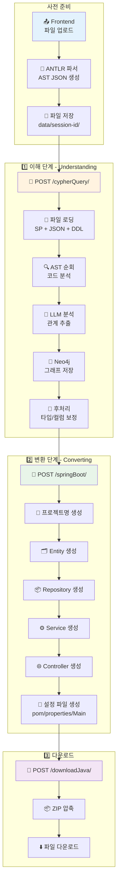
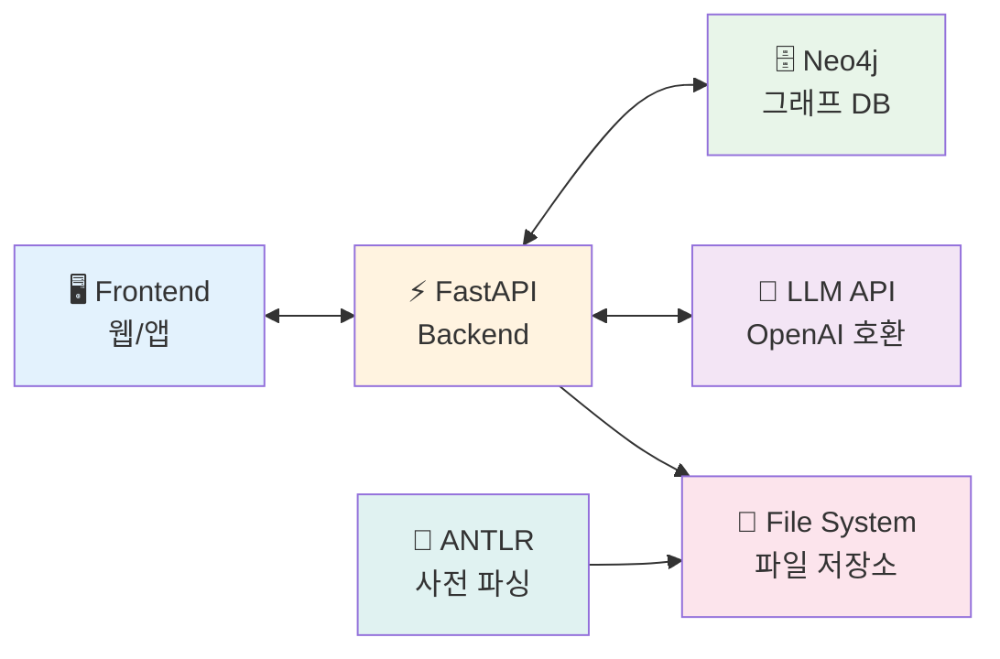

# 🔄 Legacy Modernizer Backend

> **PL/SQL 코드를 Spring Boot Java 프로젝트로 자동 변환하는 AI 기반 마이그레이션 도구**

[](https://fastapi.tiangolo.com/)
[](https://www.python.org/)
[](https://neo4j.com/)
[](https://openai.com/)

---

## 📋 목차

- [프로젝트 소개](#-프로젝트-소개)
- [핵심 기능](#-핵심-기능)
- [동작 원리](#-동작-원리)
- [시스템 아키텍처](#-시스템-아키텍처)
- [시작하기](#-시작하기)
- [API 가이드](#-api-가이드)
- [데이터 구조](#-데이터-구조)
- [디렉터리 구조](#-디렉터리-구조)
- [테스트](#-테스트)
- [문제해결](#-문제해결)

---

## 🎯 프로젝트 소개

Legacy Modernizer Backend는 **레거시 PL/SQL 코드를 최신 Spring Boot 프로젝트로 자동 변환**하는 AI 기반 도구입니다.

### 🤔 왜 이 프로젝트가 필요한가요?

많은 기업들이 오래된 Oracle PL/SQL 기반 시스템을 사용하고 있지만, 이를 최신 Java Spring Boot로 마이그레이션하는 것은 매우 어렵고 시간이 많이 걸립니다.

**기존 방식의 문제점:**
- 👨‍💻 수작업 변환: 수개월~수년 소요
- ❌ 높은 오류율: 복잡한 로직 이해 어려움
- 💰 막대한 비용: 전문 인력 필요
- 📉 일관성 부족: 개발자마다 다른 스타일

**Legacy Modernizer의 해결책:**
- ⚡ 자동 변환: 몇 분 내 완료
- 🎯 정확한 분석: AI가 코드 관계 파악
- 💡 일관된 품질: 표준화된 Spring Boot 코드 생성
- 📊 시각화: Neo4j 그래프로 코드 구조 확인

---

## ✨ 핵심 기능

### 1️⃣ **코드 이해 (Understanding)**
- ANTLR 파서로 PL/SQL 구문 분석
- LLM을 활용한 코드 의미 파악
- Neo4j 그래프 데이터베이스에 관계 저장
- DDL 파일 분석으로 테이블/컬럼 메타데이터 구성

### 2️⃣ **코드 변환 (Converting)**
- Entity 클래스 자동 생성
- Repository 인터페이스 생성
- Service 로직 변환
- REST Controller 생성
- 빌드 설정 파일 생성 (pom.xml, application.properties)

### 3️⃣ **스트리밍 응답**
- 실시간 진행률 표시
- 단계별 결과 스트리밍
- 그래프 데이터 실시간 업데이트

### 4️⃣ **세션 관리**
- 사용자별 독립적인 작업 공간
- 임시 파일 자동 관리
- 프로젝트 ZIP 다운로드

---

## 🔍 동작 원리

Legacy Modernizer는 크게 **2단계**로 동작합니다:

### 📖 1단계: 이해하기 (Understanding)

```
PL/SQL 코드 + ANTLR AST → AI 분석 → Neo4j 그래프
```

**무엇을 하나요?**
1. 📄 **파일 읽기**: 원본 PL/SQL 코드와 ANTLR이 만든 구문 트리(JSON) 읽기
2. 🔍 **구문 분석**: 코드를 한 줄씩 따라가며 "이 코드가 무엇을 하는지" 파악
3. 🤖 **AI 분석**: LLM이 코드 요약, 테이블 사용, 함수 호출 관계 추출
4. 💾 **그래프 저장**: Neo4j에 노드(프로시저, SELECT, 테이블 등)와 관계(읽기, 쓰기, 호출) 저장
5. 🔧 **후처리**: 변수 타입 보정, 컬럼 역할 파악

**왜 그래프 데이터베이스를 사용하나요?**

절차형 코드(PL/SQL)는 "A가 B를 호출하고, B가 테이블 C를 읽는다"처럼 **관계**가 복잡합니다. 
그래프 데이터베이스는 이런 관계를 **직관적으로 저장하고 탐색**할 수 있어, 변환 시 참조/의존성을 쉽게 재구성할 수 있습니다.

### 🔨 2단계: 변환하기 (Converting)

```
Neo4j 그래프 → 코드 생성 → Spring Boot 프로젝트
```

**무엇을 생성하나요?**
1. 🗂️ **Entity**: 테이블 구조를 JPA Entity 클래스로 변환
2. 📦 **Repository**: 데이터 접근 계층 인터페이스 생성
3. ⚙️ **Service**: 비즈니스 로직을 Java 메서드로 변환
4. 🌐 **Controller**: REST API 엔드포인트 생성
5. 🔧 **설정 파일**: pom.xml, application.properties, Main 클래스 생성

**변환 순서가 중요합니다:**
```
프로젝트명 생성 → Entity → Repository → Service/Controller → 설정 파일
```
각 단계는 이전 단계의 결과를 사용하므로, 순서를 지켜야 합니다.

---

## 🏗️ 시스템 아키텍처

### 전체 흐름도



### 외부 서비스 연동



**각 구성 요소 설명:**

| 구성 요소 | 역할 | 기술 스택 |
|---------|------|----------|
| 🖥️ **Frontend** | 파일 업로드, 진행률 표시, 결과 다운로드 | React/Vue 등 |
| ⚡ **Backend** | API 제공, 분석/변환 파이프라인 실행 | FastAPI (Python) |
| 🔧 **ANTLR** | PL/SQL 구문 분석 (사전 처리) | ANTLR 4 |
| 🗄️ **Neo4j** | 코드 관계 그래프 저장/조회 | Neo4j 5.x |
| 🤖 **LLM** | 코드 의미 분석, 변환 보조 | OpenAI API 호환 |
| 📁 **File System** | 원본 코드, 분석 결과, 산출물 저장 | 로컬 디스크 |

---

## 🚀 시작하기

### 📋 사전 요구사항

시작하기 전에 다음 항목들이 설치되어 있어야 합니다:

- ✅ **Python 3.10 이상**
- ✅ **Neo4j 5.x** (로컬 또는 원격)
- ✅ **Git**
- ✅ **OpenAI 호환 API 키** (OpenAI, Anthropic 등)

### 📥 1단계: 저장소 클론

```bash
git clone <repository-url>
cd Backend
```

### 📦 2단계: 의존성 설치

**방법 A: pip 사용 (간단)**
  ```bash
  pip install -r requirements.txt
  ```

**방법 B: Pipenv 사용 (권장)**
  ```bash
# Pipenv 설치 (없는 경우)
pip install pipenv

# 의존성 설치
  pipenv install --dev

# 가상 환경 활성화
  pipenv shell
  ```

### ⚙️ 3단계: 환경 변수 설정

프로젝트 루트에 `.env` 파일을 생성하고 다음 내용을 입력하세요:

```env
# Neo4j 데이터베이스 설정
NEO4J_URI=bolt://localhost:7687
NEO4J_USER=neo4j
NEO4J_PASSWORD=your-password-here

# LLM API 설정 (OpenAI 호환)
LLM_API_BASE=https://api.openai.com/v1
LLM_API_KEY=sk-your-api-key-here
LLM_MODEL=gpt-4o-mini
LLM_MAX_TOKENS=32768

# 테스트 세션용 (선택사항)
API_KEY=sk-test-api-key-here
```

**⚠️ 보안 주의사항:**
- `.env` 파일은 절대 Git에 커밋하지 마세요
- 운영 환경에서는 반드시 강력한 암호를 사용하세요
- API 키는 외부에 노출되지 않도록 주의하세요

### 🎬 4단계: 서버 실행

**방법 A: 직접 실행**
```bash
python main.py
```

**방법 B: uvicorn 사용 (개발 모드)**
```bash
uvicorn main:app --host 0.0.0.0 --port 5502 --reload
```

**방법 C: Pipenv 환경에서 실행**
```bash
pipenv run uvicorn main:app --host 0.0.0.0 --port 5502 --reload
```

서버가 정상적으로 시작되면 다음과 같은 메시지가 표시됩니다:
```
INFO:     Uvicorn running on http://0.0.0.0:5502 (Press CTRL+C to quit)
INFO:     Started reloader process [xxxxx] using StatReload
INFO:     Started server process [xxxxx]
INFO:     Waiting for application startup.
INFO:     Application startup complete.
```

### ✅ 5단계: 서버 확인

브라우저에서 다음 URL에 접속하여 서버가 정상 작동하는지 확인하세요:

```
http://localhost:5502/
```

정상이면 다음 응답이 표시됩니다:
```json
{"status": "ok"}
```

---

## 📡 API 가이드

### 공통 헤더

모든 API 요청에는 다음 헤더가 필요합니다:

| 헤더 | 필수 | 설명 | 예시 |
|-----|------|------|------|
| `Session-UUID` | ✅ | 세션 식별자 (사용자별 고유 ID) | `user-session-12345` |
| `OpenAI-Api-Key` 또는 `Anthropic-Api-Key` | ⚠️ | LLM API 키 (테스트 세션 제외) | `sk-...` |
| `Accept-Language` | ❌ | 응답 언어 (기본: `ko`) | `ko` 또는 `en` |

**⚠️ 테스트 세션 예외:**
- `Session-UUID`가 `EN_TestSession` 또는 `KO_TestSession`인 경우
- 환경 변수의 `LLM_API_KEY` 또는 `API_KEY`를 사용
- 헤더에 API 키를 포함하지 않아도 됨

---

### 🔍 API 1: 코드 분석 (Understanding)

**엔드포인트:** `POST /cypherQuery/`

**역할:** PL/SQL 코드를 분석하여 Neo4j 그래프로 저장하고, 실시간 진행률을 스트리밍으로 반환합니다.

**사전 준비:**
1. ANTLR 파서로 생성된 `analysis/{파일명}.json` 파일이 존재해야 함
2. 원본 PL/SQL 파일이 `src/{folderName}/{fileName}` 경로에 존재해야 함
3. (선택) DDL 파일이 `ddl/` 디렉터리에 존재하면 자동 분석

**요청 예시:**

```bash
curl -N -X POST "http://localhost:5502/cypherQuery/" \
  -H "Content-Type: application/json" \
  -H "Session-UUID: my-session-123" \
  -H "OpenAI-Api-Key: sk-..." \
  -H "Accept-Language: ko" \
  -d '{
    "fileInfos": [
      {
        "folderName": "PKG_ORDER",
        "fileName": "ORDER_PKG.sql"
      },
      {
        "folderName": "PKG_USER",
        "fileName": "USER_PKG.sql"
      }
    ]
  }'
```

**응답 형식 (Streaming):**

응답은 스트리밍 방식으로 전달되며, 각 청크는 `send_stream`으로 구분됩니다.

```json
{"type":"ALARM","MESSAGE":"Preparing Analysis Data"}send_stream
{"type":"ALARM","MESSAGE":"START DDL PROCESSING","file":"TABLES.sql"}send_stream
{"type":"DATA","graph":{"Nodes":[...],"Relationships":[...]},"line_number":45,"analysis_progress":30,"current_file":"PKG_ORDER-ORDER_PKG.sql"}send_stream
{"type":"DATA","graph":{"Nodes":[...],"Relationships":[...]},"line_number":120,"analysis_progress":80,"current_file":"PKG_ORDER-ORDER_PKG.sql"}send_stream
{"type":"ALARM","MESSAGE":"ALL_ANALYSIS_COMPLETED"}send_stream
```

**응답 필드 설명:**

| 필드 | 타입 | 설명 |
|-----|------|------|
| `type` | String | `ALARM` (알림) 또는 `DATA` (데이터) |
| `MESSAGE` | String | 알림 메시지 (ALARM 타입만) |
| `graph` | Object | Neo4j 그래프 객체 (DATA 타입만) |
| `line_number` | Integer | 현재 분석 중인 라인 번호 |
| `analysis_progress` | Integer | 진행률 (0~100) |
| `current_file` | String | 현재 분석 중인 파일 |

**Graph 객체 구조:**

```json
{
  "Nodes": [
    {
      "Node ID": "n1",
      "Labels": ["SELECT"],
      "Properties": {
        "startLine": 30,
        "endLine": 45,
        "file_name": "ORDER_PKG.sql",
        "folder_name": "PKG_ORDER",
        "user_id": "my-session-123",
        "summary": "주문 정보를 조회합니다"
      }
    }
  ],
  "Relationships": [
    {
      "Relationship ID": "r1",
      "Type": "FROM",
      "Start Node ID": "n1",
      "End Node ID": "t1",
      "Properties": {}
    }
  ]
}
```

---

### 🔨 API 2: 코드 변환 (Converting)

**엔드포인트:** `POST /springBoot/`

**역할:** 분석된 그래프 데이터를 기반으로 Spring Boot 프로젝트를 생성하고, 생성된 코드를 스트리밍으로 반환합니다.

**사전 준비:**
- `/cypherQuery/` API를 먼저 호출하여 분석이 완료되어야 함

**요청 예시:**

```bash
curl -N -X POST "http://localhost:5502/springBoot/" \
  -H "Content-Type: application/json" \
  -H "Session-UUID: my-session-123" \
  -H "OpenAI-Api-Key: sk-..." \
  -H "Accept-Language: ko" \
  -d '{
    "fileInfos": [
      {
        "folderName": "PKG_ORDER",
        "fileName": "ORDER_PKG.sql"
      }
    ]
  }'
```

**응답 형식 (Streaming):**

```json
{"data_type":"data","file_type":"project_name","project_name":"OrderSystem"}send_stream
{"data_type":"message","step":1,"content":"ORDER_PKG - Generating Entity Class"}send_stream
{"data_type":"data","file_type":"entity_class","file_name":"Order.java","code":"package com.ordersystem.entity;\n\nimport jakarta.persistence.*;\n\n@Entity\n@Table(name = \"ORDERS\")\npublic class Order {\n    @Id\n    @GeneratedValue(strategy = GenerationType.IDENTITY)\n    private Long id;\n    ...\n}"}send_stream
{"data_type":"Done","step":1,"file_count":1,"current_count":1}send_stream
{"data_type":"message","step":2,"content":"ORDER_PKG - Generating Repository Interface"}send_stream
{"data_type":"data","file_type":"repository_class","file_name":"OrderRepository.java","code":"..."}send_stream
{"data_type":"Done","step":2,"file_count":1,"current_count":1}send_stream
...
{"data_type":"Done"}send_stream
```

**응답 필드 설명:**

| 필드 | 타입 | 설명 |
|-----|------|------|
| `data_type` | String | `message` (진행 메시지), `data` (코드), `Done` (완료) |
| `step` | Integer | 현재 단계 (1~7) |
| `content` | String | 진행 메시지 내용 |
| `file_type` | String | 파일 유형 (`entity_class`, `repository_class`, `service_class`, `controller_class`, `command_class`, `pom`, `properties`, `main`, `project_name`) |
| `file_name` | String | 생성된 파일 이름 |
| `code` | String | 생성된 소스 코드 |
| `project_name` | String | 생성된 프로젝트 이름 |

**변환 단계:**

| 단계 | 내용 | 출력 파일 |
|-----|------|-----------|
| 0 | 프로젝트명 생성 | - |
| 1 | Entity 클래스 생성 | `*.java` (Entity) |
| 2 | Repository 인터페이스 생성 | `*Repository.java` |
| 3 | Command 클래스 생성 | `*Command.java` |
| 4 | Service/Controller 생성 | `*Service.java`, `*Controller.java` |
| 5 | pom.xml 생성 | `pom.xml` |
| 6 | application.properties 생성 | `application.properties` |
| 7 | Main 클래스 생성 | `*Application.java` |

---

### 📥 API 3: 프로젝트 다운로드

**엔드포인트:** `POST /downloadJava/`

**역할:** 생성된 Spring Boot 프로젝트를 ZIP 파일로 압축하여 다운로드합니다.

**사전 준비:**
- `/springBoot/` API를 먼저 호출하여 프로젝트 생성이 완료되어야 함

**요청 예시:**

```bash
curl -X POST "http://localhost:5502/downloadJava/" \
  -H "Content-Type: application/json" \
  -H "Session-UUID: my-session-123" \
  -d '{
    "projectName": "OrderSystem"
  }' \
  --output OrderSystem.zip
```

**응답:**
- Content-Type: `application/octet-stream`
- 파일명: `{projectName}.zip`
- ZIP 파일에는 완전한 Spring Boot 프로젝트 구조가 포함됨

---

### 🗑️ API 4: 데이터 삭제

**엔드포인트:** `DELETE /deleteAll/`

**역할:** 현재 세션의 모든 임시 파일과 Neo4j 그래프 데이터를 삭제합니다.

**요청 예시:**

  ```bash
curl -X DELETE "http://localhost:5502/deleteAll/" \
  -H "Session-UUID: my-session-123"
```

**응답:**

```json
{
  "message": "모든 임시 파일이 삭제되었습니다."
}
```

**삭제되는 항목:**
- ✅ `data/{Session-UUID}/` 디렉터리 전체
- ✅ `target/java/{Session-UUID}/` 디렉터리 전체
- ✅ Neo4j에서 `user_id`가 일치하는 모든 노드 및 관계

---

### 🌐 프론트엔드 스트리밍 파싱 가이드

스트리밍 응답을 파싱하려면 `send_stream`을 구분자로 사용해야 합니다.

**JavaScript 예시:**

```javascript
async function fetchWithStreaming(url, options) {
  const response = await fetch(url, options);
  const reader = response.body.getReader();
  const decoder = new TextDecoder();
  let buffer = '';
  
  while (true) {
    const { done, value } = await reader.read();
    if (done) break;
    
    buffer += decoder.decode(value, { stream: true });
    
    // 'send_stream'으로 청크 분리
    const parts = buffer.split('send_stream');
    buffer = parts.pop(); // 마지막 불완전한 청크는 버퍼에 남김
    
    for (const jsonText of parts) {
      if (!jsonText.trim()) continue;
      
      try {
        const payload = JSON.parse(jsonText);
        
        // payload 처리
        if (payload.type === 'ALARM') {
          console.log('알림:', payload.MESSAGE);
        } else if (payload.type === 'DATA') {
          console.log('진행률:', payload.analysis_progress + '%');
          // 그래프 데이터 처리: payload.graph
        }
      } catch (err) {
        console.error('JSON 파싱 오류:', err, jsonText);
      }
    }
  }
}

// 사용 예시
fetchWithStreaming('http://localhost:5502/cypherQuery/', {
  method: 'POST',
  headers: {
    'Content-Type': 'application/json',
    'Session-UUID': 'my-session-123',
    'OpenAI-Api-Key': 'sk-...'
  },
  body: JSON.stringify({
    fileInfos: [
      { folderName: 'PKG_ORDER', fileName: 'ORDER_PKG.sql' }
    ]
  })
});
```

**Node.js 예시:**

```javascript
const https = require('https');

let buffer = '';

const options = {
  hostname: 'localhost',
  port: 5502,
  path: '/cypherQuery/',
  method: 'POST',
  headers: {
    'Content-Type': 'application/json',
    'Session-UUID': 'my-session-123',
    'OpenAI-Api-Key': 'sk-...'
  }
};

const req = https.request(options, (res) => {
  res.on('data', (chunk) => {
    buffer += chunk.toString('utf-8');
    const parts = buffer.split('send_stream');
    buffer = parts.pop();
    
    for (const jsonText of parts) {
      if (!jsonText.trim()) continue;
      const payload = JSON.parse(jsonText);
      console.log(payload);
    }
  });
});

req.write(JSON.stringify({
  fileInfos: [
    { folderName: 'PKG_ORDER', fileName: 'ORDER_PKG.sql' }
  ]
}));

req.end();
```

---

## 📁 데이터 구조

### 세션별 파일 레이아웃

```
BASE_DIR/  (프로젝트 루트 또는 DOCKER_COMPOSE_CONTEXT)
├── data/
│   └── {Session-UUID}/              # 세션별 작업 공간
│       ├── src/                     # 원본 PL/SQL 파일
│       │   └── {folderName}/
│       │       └── {fileName}.sql
│       ├── analysis/                # ANTLR 파싱 결과
│       │   └── {baseName}.json
│       ├── ddl/                     # DDL 파일 (선택)
│       │   └── *.sql
│       └── zipfile/                 # 다운로드용 ZIP
│           └── {projectName}.zip
└── target/
    └── java/
        └── {Session-UUID}/          # 생성된 Spring Boot 프로젝트
            └── {projectName}/
                ├── src/
                │   └── main/
                │       ├── java/
                │       │   └── com/{projectName}/
                │       │       ├── entity/
                │       │       ├── repository/
                │       │       ├── service/
                │       │       ├── controller/
                │       │       └── {ProjectName}Application.java
                │       └── resources/
                │           └── application.properties
                └── pom.xml
```

### 파일 이름 규칙

| 입력 | 출력 |
|-----|------|
| `ORDER_PKG.sql` | `analysis/ORDER_PKG.json` (ANTLR) |
| `ORDER_PKG.sql` | `src/PKG_ORDER/ORDER_PKG.sql` (원본) |
| `ORDER_PKG.sql` | `entity/Order.java` (Entity) |
| `ORDER_PKG.sql` | `repository/OrderRepository.java` |
| `ORDER_PKG.sql` | `service/OrderService.java` |
| `ORDER_PKG.sql` | `controller/OrderController.java` |

**⚠️ 중요:**
- `fileInfos`의 `folderName`과 `fileName`은 실제 파일 경로와 **정확히 일치**해야 합니다
- ANTLR JSON 파일명은 원본 파일명에서 확장자만 제거한 것입니다 (`ORDER_PKG.sql` → `ORDER_PKG.json`)
- 대소문자를 구분합니다

---

## 🗄️ Neo4j 그래프 모델

### 노드 타입

| 노드 라벨 | 설명 | 주요 속성 |
|---------|------|----------|
| `Folder` | 폴더 (패키지) | `name`, `user_id`, `has_children` |
| `FILE` | PL/SQL 파일 | `file_name`, `folder_name`, `user_id` |
| `PROCEDURE` | 프로시저 | `procedure_name`, `startLine`, `endLine`, `summary` |
| `FUNCTION` | 함수 | `procedure_name`, `startLine`, `endLine`, `summary` |
| `SELECT` | SELECT 구문 | `startLine`, `endLine`, `summary` |
| `INSERT` | INSERT 구문 | `startLine`, `endLine`, `summary` |
| `UPDATE` | UPDATE 구문 | `startLine`, `endLine`, `summary` |
| `DELETE` | DELETE 구문 | `startLine`, `endLine`, `summary` |
| `CALL` | 프로시저 호출 | `startLine`, `endLine`, `summary` |
| `Table` | 테이블 | `name`, `schema`, `description`, `table_type` |
| `Column` | 컬럼 | `name`, `dtype`, `fqn`, `nullable`, `description` |
| `Variable` | 변수 | `name`, `type`, `scope`, `role`, `value` |
| `DBLink` | DB 링크 | `name`, `user_id` |

### 관계 타입

| 관계 | 설명 | 예시 |
|-----|------|------|
| `CONTAINS` | 포함 관계 | `Folder → Table`, `Folder → PROCEDURE` |
| `PARENT_OF` | 부모-자식 관계 | `PROCEDURE → SELECT` |
| `NEXT` | 순차 실행 관계 | `SELECT → UPDATE` |
| `FROM` | 읽기 관계 | `SELECT → Table` |
| `WRITES` | 쓰기 관계 | `INSERT/UPDATE/DELETE → Table` |
| `EXECUTE` | 실행 관계 | `CALL/EXECUTE_IMMEDIATE → PROCEDURE` |
| `CALL` | 호출 관계 | `PROCEDURE → PROCEDURE` (scope: internal/external) |
| `HAS_COLUMN` | 컬럼 보유 | `Table → Column` |
| `FK_TO` | 외래 키 | `Column → Column` |
| `FK_TO_TABLE` | 외래 키 테이블 | `Table → Table` |
| `SCOPE` | 스코프 관계 | `DECLARE/SPEC → Variable` |
| `DB_LINK` | DB 링크 | `DML → Table` (mode: r/w) |

### 그래프 예시

```
[Folder: PKG_ORDER]
    ↓ CONTAINS
[PROCEDURE: CREATE_ORDER]
    ↓ PARENT_OF
[SELECT: "주문 정보 조회"]
    ↓ FROM
[Table: ORDERS]
    ↓ HAS_COLUMN
[Column: ORDER_ID (PK)]
```

---

## 📂 디렉터리 구조

```
Backend/
├── 📄 main.py                      # FastAPI 애플리케이션 진입점
├── 📄 Dockerfile                   # Docker 빌드 설정
├── 📄 requirements.txt             # Python 의존성 목록
├── 📄 Pipfile                      # Pipenv 설정
├── 📄 Pipfile.lock                 # Pipenv 잠금 파일
├── 📄 README.md                    # 프로젝트 문서 (이 파일)
│
├── 📁 service/                     # API 서비스 계층
│   ├── router.py                   # API 엔드포인트 정의
│   └── service.py                  # 핵심 비즈니스 로직 (이해/변환 파이프라인)
│
├── 📁 understand/                  # 이해(Understanding) 단계
│   ├── analysis.py                 # AST 분석기 (Analyzer 클래스)
│   └── neo4j_connection.py         # Neo4j 연결 및 쿼리 실행
│
├── 📁 convert/                     # 변환(Converting) 단계
│   ├── create_entity.py            # JPA Entity 생성
│   ├── create_repository.py        # Repository 인터페이스 생성
│   ├── create_service_skeleton.py  # Service 클래스 뼈대 생성
│   ├── create_service_preprocessing.py   # Service 전처리
│   ├── create_service_postprocessing.py  # Service 후처리
│   ├── create_controller_skeleton.py     # Controller 뼈대 생성
│   ├── create_controller.py        # Controller 메서드 생성
│   ├── create_main.py              # Main 클래스 생성
│   ├── create_properties.py        # application.properties 생성
│   └── create_pomxml.py            # pom.xml 생성
│
├── 📁 prompt/                      # LLM 프롬프트 정의
│   ├── understand_ddl.py           # DDL 분석 프롬프트
│   ├── understand_prompt.py        # 코드 분석 프롬프트
│   ├── understand_summarized_prompt.py    # 요약 프롬프트
│   ├── understand_column_prompt.py        # 컬럼 역할 분석
│   ├── understand_variables_prompt.py     # 변수 분석
│   ├── convert_entity_prompt.py           # Entity 변환 프롬프트
│   ├── convert_repository_prompt.py       # Repository 변환 프롬프트
│   ├── convert_service_prompt.py          # Service 변환 프롬프트
│   ├── convert_service_skeleton_prompt.py # Service 뼈대 프롬프트
│   ├── convert_controller_prompt.py       # Controller 변환 프롬프트
│   ├── convert_command_prompt.py          # Command 클래스 프롬프트
│   ├── convert_variable_prompt.py         # 변수 변환 프롬프트
│   ├── convert_project_name_prompt.py     # 프로젝트명 생성 프롬프트
│   └── convert_summarized_service_prompt.py # Service 요약 프롬프트
│
├── 📁 util/                        # 유틸리티
│   ├── utility_tool.py             # 공통 유틸 함수 (라인 번호, 토큰 계산 등)
│   ├── llm_client.py               # LLM API 클라이언트
│   └── exception.py                # 커스텀 예외 정의
│
└── 📁 test/                        # 테스트 코드
    ├── test_understanding.py       # 이해 단계 테스트
    └── test_converting/            # 변환 단계 테스트
        ├── test_1_entity.py
        ├── test_2_repository.py
        ├── test_3_service_skeleton.py
        ├── test_4_service.py
        └── test_5_controller.py
```

### 주요 모듈 설명

#### 📡 `service/router.py`
API 엔드포인트를 정의하고 요청을 처리합니다.

**주요 함수:**
- `understand_data()`: `/cypherQuery/` 엔드포인트
- `covnert_spring_project()`: `/springBoot/` 엔드포인트
- `download_spring_project()`: `/downloadJava/` 엔드포인트
- `delete_all_data()`: `/deleteAll/` 엔드포인트

#### ⚙️ `service/service.py`
이해/변환 파이프라인의 핵심 로직을 구현합니다.

**주요 함수:**
- `generate_and_execute_cypherQuery()`: 이해 단계 실행
- `process_ddl_and_table_nodes()`: DDL 파일 분석
- `postprocess_table_variables()`: 변수 타입 보정 및 컬럼 역할 산출
- `generate_spring_boot_project()`: 변환 단계 실행
- `process_project_zipping()`: ZIP 압축
- `delete_all_temp_data()`: 데이터 삭제
- `validate_anthropic_api_key()`: API 키 검증

#### 🔍 `understand/analysis.py`
ANTLR AST를 DFS 순회하며 코드를 분석합니다.

**주요 클래스:**
- `Analyzer`: AST 분석기
  - `run()`: 분석 실행
  - `analyze_statement_tree()`: 구문 트리 순회
  - `execute_analysis_and_reset_state()`: LLM 분석 실행
  - `process_analysis_output_to_cypher()`: Cypher 쿼리 생성
  - `analyze_variable_declarations()`: 변수 선언 분석

#### 🗄️ `understand/neo4j_connection.py`
Neo4j 데이터베이스 연결 및 쿼리 실행을 담당합니다.

**주요 클래스:**
- `Neo4jConnection`: Neo4j 비동기 드라이버 래퍼
  - `execute_queries()`: 다중 쿼리 실행
  - `execute_query_and_return_graph()`: 그래프 조회
  - `node_exists()`: 노드 존재 확인

#### 🔨 `convert/*`
Spring Boot 프로젝트의 각 구성 요소를 생성합니다.

| 파일 | 생성 대상 |
|-----|----------|
| `create_entity.py` | JPA Entity 클래스 |
| `create_repository.py` | Repository 인터페이스 |
| `create_service_skeleton.py` | Service 클래스 뼈대 |
| `create_service_preprocessing.py` | 변수/시퀀스/쿼리 결합 |
| `create_service_postprocessing.py` | 최종 Service 메서드 |
| `create_controller_skeleton.py` | Controller 뼈대 |
| `create_controller.py` | Controller 메서드 |
| `create_main.py` | Main 클래스 |
| `create_properties.py` | application.properties |
| `create_pomxml.py` | pom.xml |

#### 💬 `prompt/*`
LLM에게 전달할 프롬프트를 정의합니다.

**이해 단계 프롬프트:**
- DDL 해석, 코드 분석, 변수 분석, 컬럼 역할 분석 등

**변환 단계 프롬프트:**
- Entity 생성, Repository 생성, Service 생성, Controller 생성 등

#### 🛠️ `util/utility_tool.py`
공통 유틸리티 함수를 제공합니다.

**주요 함수:**
- `add_line_numbers()`: 코드에 라인 번호 추가
- `calculate_code_token()`: 토큰 수 계산
- `parse_table_identifier()`: 테이블 식별자 파싱 (schema.table 분리)

---

## 🧪 테스트

### 테스트 실행

**모든 테스트 실행:**
```bash
pytest -v
```

**특정 테스트만 실행:**
```bash
# 이해 단계 테스트
pytest test/test_understanding.py -v

# 변환 단계 테스트 (순서대로)
pytest test/test_converting/test_1_entity.py -v
pytest test/test_converting/test_2_repository.py -v
pytest test/test_converting/test_3_service_skeleton.py -v
pytest test/test_converting/test_4_service.py -v
pytest test/test_converting/test_5_controller.py -v
```

**Pipenv 환경에서 실행:**
```bash
pipenv run pytest -v
```

### 테스트 커버리지 확인

```bash
pytest --cov=. --cov-report=html
```

HTML 리포트는 `htmlcov/index.html`에서 확인할 수 있습니다.

---

## 🔧 문제해결

### ❌ 자주 발생하는 오류

#### 1. `Session-UUID가 없습니다`

**원인:** 요청 헤더에 `Session-UUID`가 누락되었습니다.

**해결:**
```bash
curl ... -H "Session-UUID: your-session-id"
```

#### 2. `API 키가 없습니다` / `유효하지 않은 API 키입니다`

**원인:** 
- 헤더에 `OpenAI-Api-Key` 또는 `Anthropic-Api-Key`가 누락되었거나
- 잘못된 API 키를 사용했습니다

**해결:**
```bash
# OpenAI
curl ... -H "OpenAI-Api-Key: sk-..."

# Anthropic
curl ... -H "Anthropic-Api-Key: sk-ant-..."
```

**테스트 세션의 경우:**
`.env` 파일에 다음을 추가하세요:
```env
LLM_API_KEY=sk-your-api-key-here
```

#### 3. `파일 정보가 없습니다`

**원인:** 요청 바디에 `fileInfos`가 누락되었거나 비어있습니다.

**해결:**
```json
{
  "fileInfos": [
    {
      "folderName": "PKG_ORDER",
      "fileName": "ORDER_PKG.sql"
    }
  ]
}
```

#### 4. `FileNotFoundError: [Errno 2] No such file or directory`

**원인:** 
- ANTLR JSON 파일 또는 원본 PL/SQL 파일이 존재하지 않습니다
- 파일 경로가 잘못되었습니다

**해결:**
1. 파일이 올바른 위치에 있는지 확인:
   ```
   data/{Session-UUID}/src/{folderName}/{fileName}
   data/{Session-UUID}/analysis/{baseName}.json
   ```

2. `folderName`과 `fileName`이 요청과 정확히 일치하는지 확인 (대소문자 구분)

#### 5. `Neo4j 연결 오류`

**원인:** Neo4j 서버가 실행되지 않았거나 연결 정보가 잘못되었습니다.

**해결:**
1. Neo4j 서버가 실행 중인지 확인:
   ```bash
   # Neo4j Desktop 또는
   neo4j start
   ```

2. `.env` 파일의 연결 정보 확인:
   ```env
   NEO4J_URI=bolt://localhost:7687
   NEO4J_USER=neo4j
   NEO4J_PASSWORD=your-password
   ```

3. Neo4j Browser에서 수동 연결 테스트:
   ```
   http://localhost:7474
   ```

#### 6. `LLM API 호출 오류`

**원인:** 
- API 키가 만료되었거나 할당량 초과
- LLM API 서버 오류
- 네트워크 연결 문제

**해결:**
1. API 키 유효성 확인
2. 할당량 확인 (OpenAI Dashboard 등)
3. `LLM_API_BASE` 환경 변수 확인:
   ```env
   LLM_API_BASE=https://api.openai.com/v1
   ```

#### 7. `토큰 제한 초과`

**원인:** 분석할 코드가 LLM의 최대 토큰 제한을 초과했습니다.

**해결:**
1. `.env`에서 `LLM_MAX_TOKENS` 조정:
   ```env
   LLM_MAX_TOKENS=32768
   ```

2. 더 큰 컨텍스트를 지원하는 모델 사용:
   ```env
   LLM_MODEL=gpt-4-turbo-preview  # 128k 토큰
   ```

---

### 🐛 디버깅 팁

#### 로그 레벨 조정

`main.py`에서 로그 레벨을 변경할 수 있습니다:

```python
logging.basicConfig(
    level=logging.DEBUG,  # INFO → DEBUG로 변경
    format='%(levelname)s: %(message)s',
    force=True
)
```

#### Neo4j 데이터 확인

Neo4j Browser에서 데이터를 직접 조회할 수 있습니다:

```cypher
// 전체 노드 조회
MATCH (n {user_id: 'your-session-id'})
RETURN n LIMIT 25

// 특정 프로시저 조회
MATCH (p:PROCEDURE {user_id: 'your-session-id'})
RETURN p

// 테이블 관계 조회
MATCH (n)-[r:FROM|WRITES]->(t:Table {user_id: 'your-session-id'})
RETURN n, r, t
```

#### 생성된 파일 확인

```bash
# 생성된 Spring Boot 프로젝트 확인
ls -la target/java/{Session-UUID}/{projectName}/

# Entity 파일 확인
cat target/java/{Session-UUID}/{projectName}/src/main/java/com/{projectName}/entity/*.java
```

---

## 🎓 추가 자료

### 관련 기술 문서

- [FastAPI 공식 문서](https://fastapi.tiangolo.com/)
- [Neo4j 공식 문서](https://neo4j.com/docs/)
- [ANTLR 공식 문서](https://www.antlr.org/)
- [Spring Boot 공식 문서](https://spring.io/projects/spring-boot)
- [OpenAI API 문서](https://platform.openai.com/docs/)

### 프로젝트 철학

> **"사람 입장에서 이해하기 쉬운 관계를 먼저 만들고, 그 위에 코드 생성을 쌓습니다."**

- 📊 **그래프 우선**: 코드의 관계를 그래프로 표현하여 직관적으로 이해
- 🔄 **단계별 처리**: 이해 → 변환으로 명확히 분리하여 각 단계에 집중
- 📝 **보수적 병합**: MERGE를 사용하여 중복 방지, 기존 데이터 보존
- 📢 **투명한 진행**: 스트리밍으로 실시간 진행 상황 공개
- 💬 **쉬운 표현**: "읽는다/쓴다/호출한다" 같은 직관적인 관계명 사용

---

## 📞 지원

문제가 발생하거나 질문이 있으시면 이슈를 생성해 주세요.

---

## 📄 라이선스

이 프로젝트는 [라이선스명]에 따라 배포됩니다.

---

<div align="center">

**Made with ❤️ by Legacy Modernizer Team**

⭐ 이 프로젝트가 유용하다면 Star를 눌러주세요!

</div>
