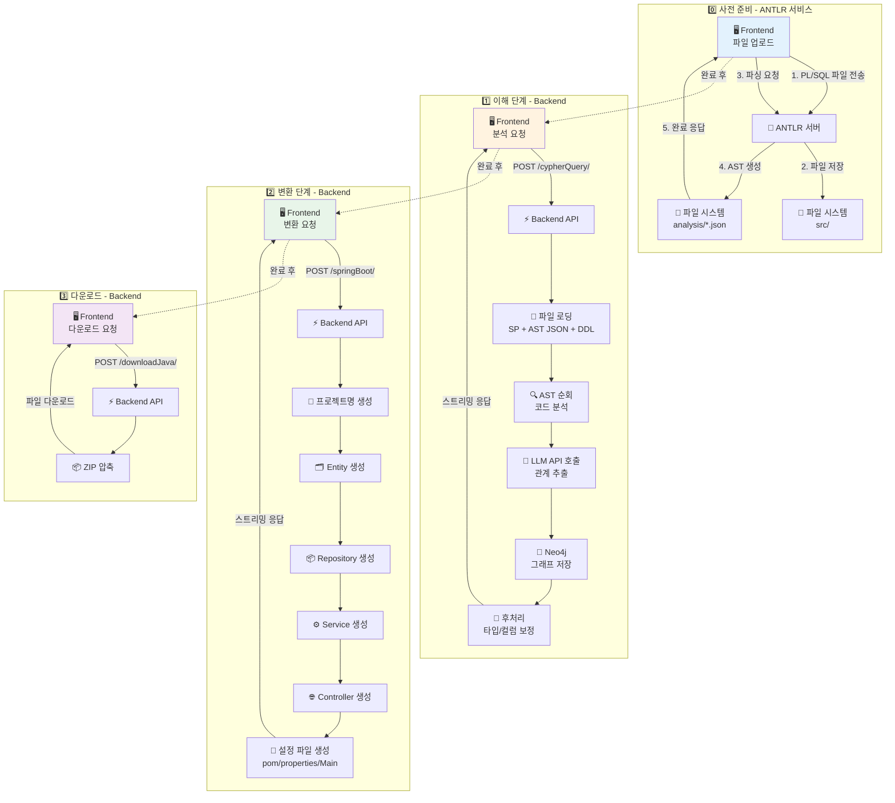
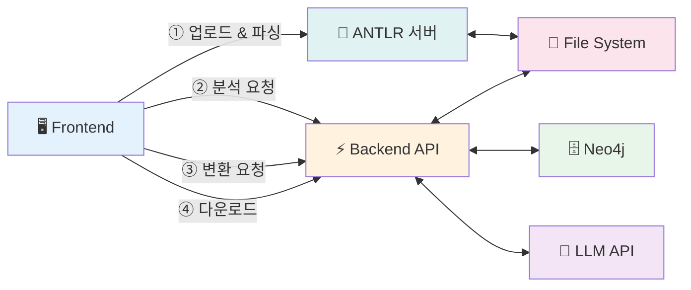

# 🔄 Legacy Modernizer Backend

> **PL/SQL 코드를 Spring Boot Java 프로젝트로 자동 변환하는 AI 기반 마이그레이션 도구**

[](https://fastapi.tiangolo.com/)
[](https://www.python.org/)
[](https://neo4j.com/)
[](https://openai.com/)

---

## 📋 목차

- [프로젝트 소개](#-프로젝트-소개)
- [핵심 기능](#-핵심-기능)
- [동작 원리](#-동작-원리)
- [시스템 아키텍처](#-시스템-아키텍처)
- [시작하기](#-시작하기)
- [API 가이드](#-api-가이드)
- [데이터 구조](#-데이터-구조)
- [디렉터리 구조](#-디렉터리-구조)
- [테스트](#-테스트)
- [문제해결](#-문제해결)

---

## 🎯 프로젝트 소개

Legacy Modernizer Backend는 **레거시 PL/SQL 코드를 최신 Spring Boot 프로젝트로 자동 변환**하는 AI 기반 도구입니다.

### 🤔 왜 이 프로젝트가 필요한가요?

많은 기업들이 오래된 Oracle PL/SQL 기반 시스템을 사용하고 있지만, 이를 최신 Java Spring Boot로 마이그레이션하는 것은 매우 어렵고 시간이 많이 걸립니다.

**기존 방식의 문제점:**
- 👨‍💻 수작업 변환: 수개월~수년 소요
- ❌ 높은 오류율: 복잡한 로직 이해 어려움  
- 💰 막대한 비용: 전문 인력 필요
- 📉 일관성 부족: 개발자마다 다른 스타일

**Legacy Modernizer의 해결책:**
- ⚡ 자동 변환: 몇 분 내 완료
- 🎯 정확한 분석: AI가 코드 관계 파악
- 💡 일관된 품질: 표준화된 Spring Boot 코드 생성
- 📊 시각화: Neo4j 그래프로 코드 구조 확인

---

## ✨ 핵심 기능

### 1️⃣ **코드 이해 (Understanding)**
- ANTLR 파서가 PL/SQL을 분석하여 파싱한 결과물을 기반으로, 실제 PL/SQL를 순회하면서 LLM을 활용한 코드 의미 파악합니다.
- 의미 파악이 완료된 SP 코드 구문들을 Neo4j 그래프 데이터베이스에 노드 및 관계 형태로 저장합니다.
- 이때, DDL은 또한 LLM을 활용하여 테이블/컬럼 형태로 그래프 데이터베이스에 저장됩니다.

### 2️⃣ **코드 변환 (Converting)**
- Entity 클래스 생성
- Repository 인터페이스 생성
- Service 로직 변환
- REST Controller 생성
- 빌드 설정 파일 생성 (pom.xml, application.properties)

### 3️⃣ **스트리밍 응답**
- 실시간 진행률 표시
- 단계별 결과 스트리밍
- 그래프 데이터 실시간 업데이트

### 4️⃣ **세션 관리**
- 사용자별 독립적인 작업 공간
- 프로젝트 ZIP 다운로드

---

## 🔍 동작 원리

Legacy Modernizer는 크게 **3단계**로 동작합니다:

### 🔧 0단계: 사전 준비 (파일 업로드 & ANTLR 파싱)

```
Frontend → ANTLR 서버 (업로드 + 파싱 완료) → Frontend 응답
```

**무엇을 하나요?**
1. 🖥️ **파일 업로드**: Frontend에서 PL/SQL 파일을 ANTLR 서버로 전송
2. 💾 **파일 저장**: ANTLR 서버가 파일을 `data/{session-id}/src/` 디렉터리에 저장
3. 🔍 **파싱 요청**: Frontend가 ANTLR 서버에 저장된 파일의 파싱 요청
4. 📊 **AST 생성**: ANTLR이 PL/SQL 코드를 파싱하여 AST(추상 구문 트리) 생성
5. 💾 **JSON 저장**: AST를 JSON 형식으로 `data/{session-id}/analysis/{파일명}.json`에 저장
6. ✅ **완료 응답**: ANTLR 서버가 Frontend에 업로드 및 파싱 완료 메시지 전송

**⚠️ 중요:** 
- 이 단계는 **Backend가 아닌 별도의 ANTLR 서버**에서 처리됩니다
- **업로드와 파싱**이 모두 완료된 후 Frontend에 응답합니다
- Backend API를 호출하기 **전에 반드시 완료**되어야 합니다
- 생성된 JSON 파일이 없으면 다음 분석 단계가 실패합니다

### 📖 1단계: 이해하기 (Understanding)

```
Frontend → Backend API → PL/SQL + AST JSON 읽기 → AI 분석 → Neo4j 그래프 저장
```

**무엇을 하나요?**
1. 📤 **분석 요청**: Frontend가 Backend의 `/cypherQuery/` API 호출 (ANTLR에서 받은 폴더명, 파일명 전달)
2. 📂 **파일 경로 구성**: Backend가 전달받은 폴더명/파일명으로 파일 경로 생성
3. 📄 **파일 로딩**: File System에서 원본 PL/SQL 코드와 ANTLR AST JSON 읽기
4. 🔍 **구문 탐색**: 구문 트리를 바탕으로, 각 구문들을 순회하면서, 분석할 구문들을 컨텍스트에 담습니다
5. 🤖 **AI 분석**: 컨텍스트 사이즈가 한계에 도달하면, LLM을 활용하여, 분석을 진행합니다
6. 💾 **그래프 저장**: 분석 결과로 나온 데이터를 활용하여, 사이퍼쿼리 형태로 만든 뒤, Neo4j에 노드와 관계 형태로 저장합니다
7. 🔧 **후처리**: 변수 타입 보정 (DDL 메타 참조), 컬럼 역할 파악
8. 📡 **스트리밍 응답**: Frontend에 실시간으로 진행률과 그래프 데이터 전송

**왜 그래프 데이터베이스를 사용하나요?**

절차형 코드(PL/SQL)는 "A가 B를 호출하고, B가 테이블 C를 읽는다"처럼 **관계**가 복잡합니다. 
그래프 데이터베이스는 이런 관계를 **직관적으로 저장하고 탐색**할 수 있어, 변환 시 참조/의존성을 쉽게 재구성할 수 있습니다.

### 🔨 2단계: 변환하기 (Converting)

```
Frontend → Backend API → Neo4j 그래프 조회 → 코드 생성 → Spring Boot 프로젝트
```

**무엇을 생성하나요?**
1. 📤 **변환 요청**: Frontend가 Backend의 `/springBoot/` API 호출 (폴더명, 파일명 전달)
2. 📊 **그래프 조회**: Neo4j에서 저장된 관계 데이터 조회
3. 📄 **원본 참조**: File System에서 원본 SP 코드 읽기 (필요시)
4. 🗂️ **Entity 생성**: 테이블 구조를 JPA Entity 클래스로 변환
5. 📦 **Repository 생성**: 데이터 접근 계층 인터페이스 생성
6. ⚙️ **Service 생성**: 비즈니스 로직을 Java 메서드로 변환
7. 🌐 **Controller 생성**: REST API 엔드포인트 생성
8. 🔧 **설정 파일 생성**: pom.xml, application.properties, Main 클래스 생성
9. 💾 **파일 저장**: `target/java/{session-id}/{project-name}/` 디렉터리에 저장
10. 📡 **스트리밍 응답**: Frontend에 생성된 코드 조각 실시간 전송

**변환 순서가 중요합니다:**
```
프로젝트명 생성 → Entity → Repository → Service/Controller → 설정 파일
```
각 단계는 이전 단계의 결과를 사용하므로, 순서를 지켜야 합니다.

### 📥 3단계: 다운로드 (Download)

```
Frontend → Backend API → ZIP 압축 → 파일 다운로드
```

**무엇을 하나요?**
1. 📤 **다운로드 요청**: Frontend가 Backend의 `/downloadJava/` API 호출
2. 📦 **ZIP 압축**: 생성된 Spring Boot 프로젝트 전체를 ZIP 파일로 압축
3. ⬇️ **파일 전송**: Frontend에 ZIP 파일 전송
4. 💻 **로컬 저장**: 사용자가 ZIP 파일을 로컬에 저장하여 사용

---

## 🏗️ 시스템 아키텍처

### 전체 흐름도



### 외부 서비스 연동



**각 구성 요소 역할:**

| 구성 요소 | 역할 | 기술 스택 |
|---------|------|----------|
| 🖥️ **Frontend** | 사용자 인터페이스, 파일 업로드, API 요청 | React/Vue 등 |
| 🔧 **ANTLR 서버** | PL/SQL 파싱, AST JSON 생성 | ANTLR 4 |
| ⚡ **Backend API** | 분석/변환 파이프라인 실행 | FastAPI (Python) |
| 📁 **File System** | 파일 저장소 (SP 코드, AST, Java 코드) | 로컬 디스크 |
| 🗄️ **Neo4j** | 코드 관계 그래프 저장/조회 | Neo4j 5.x |
| 🤖 **LLM API** | 코드 분석 및 생성 | OpenAI 호환 |

**주요 데이터 흐름:**
- **① ANTLR 단계**: Frontend → ANTLR ↔ File System (업로드 & 파싱)
- **② 분석 단계**: Frontend → Backend ↔ File System/Neo4j/LLM (코드 분석)
- **③ 변환 단계**: Frontend → Backend ↔ Neo4j/LLM/File System (코드 생성)
- **④ 다운로드**: Frontend → Backend (ZIP 다운로드)

**📌 실제 호출 순서:**

### [0단계: ANTLR 서비스 - 업로드 & 파싱]

| 순서 | 흐름 | 설명 |
|-----|------|------|
| 1 | Frontend → ANTLR | PL/SQL 파일 업로드 |
| 2 | ANTLR → File System | 원본 파일 저장 (`src/{folderName}/{fileName}`) |
| 3 | Frontend → ANTLR | 파싱 요청 |
| 4 | ANTLR → File System | AST JSON 생성 및 저장 (`analysis/{baseName}.json`) |
| 5 | ANTLR → Frontend | ✅ 업로드 및 파싱 완료 응답 (폴더명, 파일명 포함) |

### [1단계: Backend - 분석]

| 순서 | 흐름 | 설명 |
|-----|------|------|
| 6 | Frontend → Backend | `/cypherQuery/` 분석 요청 (폴더명, 파일명 전달) |
| 7 | Backend → File System | 📂 **전달받은 경로로 파일 읽기**<br/>- SP 코드: `src/{folderName}/{fileName}`<br/>- AST JSON: `analysis/{baseName}.json` |
| 8 | Backend → LLM | 코드 분석 요청 (SP 코드 + AST 기반) |
| 9 | Backend → Neo4j | 분석 결과 그래프 저장 |
| 10 | Backend → Frontend | ✅ 스트리밍 응답 (그래프 + 진행률) |

### [2단계: Backend - 변환]

| 순서 | 흐름 | 설명 |
|-----|------|------|
| 11 | Frontend → Backend | `/springBoot/` 변환 요청 (폴더명, 파일명 전달) |
| 12 | Backend → Neo4j | 그래프 데이터 조회 |
| 13 | Backend → File System | 📂 원본 SP 코드 읽기 (필요시) |
| 14 | Backend → LLM | 코드 생성 요청 |
| 15 | Backend → File System | 💾 생성된 Java 파일 저장 (`target/java/...`) |
| 16 | Backend → Frontend | ✅ 스트리밍 응답 (생성 코드) |

### [3단계: Backend - 다운로드]

| 순서 | 흐름 | 설명 |
|-----|------|------|
| 17 | Frontend → Backend | `/downloadJava/` 다운로드 요청 (프로젝트명) |
| 18 | Backend → File System | 📦 생성된 프로젝트 ZIP 압축 |
| 19 | Backend → Frontend | ✅ ZIP 파일 전송 |

---

## 🚀 시작하기

### 📋 사전 요구사항

시작하기 전에 다음 항목들이 설치되어 있어야 합니다:

- ✅ **Python 3.10 이상**
- ✅ **Neo4j 5.x** (로컬 또는 원격)
- ✅ **Git**
- ✅ **OpenAI 호환 API 키** (OpenAI, Anthropic 등)

### 📥 1단계: 저장소 클론

```bash
git clone <repository-url>
```

### 📦 2단계: 의존성 설치

**방법 A: uv pip 사용**
  ```bash
  uv venv
  uv pip install -r requirements.txt
  source .venv/Scripts/activate
  ```

**방법 B: Pipenv 사용**
  ```bash
# Pipenv 설치 (없는 경우)
pip install pipenv

# 가상 환경 활성화
  pipenv shell

# 의존성 설치
  pipenv install
  ```

### ⚙️ 3단계: 환경 변수 설정

프로젝트 루트에 `.env` 파일을 생성하고 다음 내용을 입력하세요:

```env
# Neo4j 데이터베이스 설정
NEO4J_URI=bolt://localhost:7687
NEO4J_USER=neo4j
NEO4J_PASSWORD=your-password-here

# LLM API 설정 (OpenAI 호환)
LLM_API_BASE=https://api.openai.com/v1
LLM_API_KEY=sk-your-api-key-here
LLM_MODEL=model
```

**⚠️ 보안 주의사항:**
- `.env` 파일은 절대 Git에 커밋하지 마세요
- 운영 환경에서는 반드시 강력한 암호를 사용하세요
- API 키는 외부에 노출되지 않도록 주의하세요

### 🎬 4단계: 서버 실행

```bash
python main.py
```


## 📡 API 가이드

### 공통 헤더

모든 API 요청에는 다음 헤더가 필요합니다:

| 헤더 | 필수 | 설명 | 예시 |
|-----|------|------|------|
| `Session-UUID` | ✅ | 세션 식별자 (사용자별 고유 ID) | `user-session-12345` |
| `OpenAI-Api-Key` 또는 `Anthropic-Api-Key` | ⚠️ | LLM API 키 (테스트 세션 제외) | `sk-...` |
| `Accept-Language` | ❌ | 응답 언어 (기본: `ko`) | `ko` 또는 `en` |

**⚠️ 테스트 세션 예외:**
- `Session-UUID`가 `EN_TestSession` 또는 `KO_TestSession`인 경우
- 환경 변수의 `LLM_API_KEY` 또는 `API_KEY`를 사용
- 헤더에 API 키를 포함하지 않아도 됨

---

### 🔍 API 1: 코드 분석 (Understanding)

**엔드포인트:** `POST /cypherQuery/`

**역할:** PL/SQL 코드를 분석하여 Neo4j 그래프로 저장하고, 실시간 진행률을 스트리밍으로 반환합니다.

**사전 준비:**
1. ANTLR 서비스에서 파일 업로드 및 파싱 완료
2. ANTLR로부터 받은 **폴더명(`folderName`)** 과 **파일명(`fileName`)** 을 요청 바디에 포함
3. File System에 다음 파일들이 존재해야 함:
   - 원본 PL/SQL: `data/{session-id}/src/{folderName}/{fileName}`
   - AST JSON: `data/{session-id}/analysis/{baseName}.json`
   - (선택) DDL: `data/{session-id}/ddl/*.sql`

**요청 예시:**

```bash
curl -N -X POST "http://localhost:5502/cypherQuery/" \
  -H "Content-Type: application/json" \
  -H "Session-UUID: my-session-123" \
  -H "OpenAI-Api-Key: sk-..." \
  -H "Accept-Language: ko" \
  -d '{
      "fileInfos": [
      {
        "folderName": "PKG_ORDER",
        "fileName": "ORDER_PKG.sql"
      },
      {
        "folderName": "PKG_USER",
        "fileName": "USER_PKG.sql"
      }
    ]
  }'
```

**응답 형식 (Streaming):**

응답은 스트리밍 방식으로 전달되며, 각 청크는 `send_stream`으로 구분됩니다.

```json
{"type":"ALARM","MESSAGE":"Preparing Analysis Data"}send_stream
{"type":"ALARM","MESSAGE":"START DDL PROCESSING","file":"TABLES.sql"}send_stream
{"type":"DATA","graph":{"Nodes":[...],"Relationships":[...]},"line_number":45,"analysis_progress":30,"current_file":"PKG_ORDER-ORDER_PKG.sql"}send_stream
{"type":"DATA","graph":{"Nodes":[...],"Relationships":[...]},"line_number":120,"analysis_progress":80,"current_file":"PKG_ORDER-ORDER_PKG.sql"}send_stream
{"type":"ALARM","MESSAGE":"ALL_ANALYSIS_COMPLETED"}send_stream
```

**응답 필드 설명:**

| 필드 | 타입 | 설명 |
|-----|------|------|
| `type` | String | `ALARM` (알림) 또는 `DATA` (데이터) |
| `MESSAGE` | String | 알림 메시지 (ALARM 타입만) |
| `graph` | Object | Neo4j 그래프 객체 (DATA 타입만) |
| `line_number` | Integer | 현재 분석 중인 라인 번호 |
| `analysis_progress` | Integer | 진행률 (0~100) |
| `current_file` | String | 현재 분석 중인 파일 |

**Graph 객체 구조:**

  ```json
  {
  "Nodes": [
    {
      "Node ID": "n1",
      "Labels": ["SELECT"],
      "Properties": {
        "startLine": 30,
        "endLine": 45,
        "file_name": "ORDER_PKG.sql",
        "folder_name": "PKG_ORDER",
        "user_id": "my-session-123",
        "summary": "주문 정보를 조회합니다"
      }
    }
  ],
  "Relationships": [
    {
      "Relationship ID": "r1",
      "Type": "FROM",
      "Start Node ID": "n1",
      "End Node ID": "t1",
      "Properties": {}
    }
    ]
  }
  ```

---

### 🔨 API 2: 코드 변환 (Converting)

**엔드포인트:** `POST /springBoot/`

**역할:** 분석된 그래프 데이터를 기반으로 Spring Boot 프로젝트를 생성하고, 생성된 코드를 스트리밍으로 반환합니다.

**사전 준비:**
- `/cypherQuery/` API를 먼저 호출하여 분석이 완료되어야 함
- ANTLR로부터 받은 **폴더명(`folderName`)** 과 **파일명(`fileName`)** 을 요청 바디에 포함

**요청 예시:**

```bash
curl -N -X POST "http://localhost:5502/springBoot/" \
  -H "Content-Type: application/json" \
  -H "Session-UUID: my-session-123" \
  -H "OpenAI-Api-Key: sk-..." \
  -H "Accept-Language: ko" \
  -d '{
    "fileInfos": [
      {
        "folderName": "PKG_ORDER",
        "fileName": "ORDER_PKG.sql"
      }
    ]
  }'
```

**응답 형식 (Streaming):**

```json
{"data_type":"data","file_type":"project_name","project_name":"OrderSystem"}send_stream
{"data_type":"message","step":1,"content":"ORDER_PKG - Generating Entity Class"}send_stream
{"data_type":"data","file_type":"entity_class","file_name":"Order.java","code":"package com.ordersystem.entity;\n\nimport jakarta.persistence.*;\n\n@Entity\n@Table(name = \"ORDERS\")\npublic class Order {\n    @Id\n    @GeneratedValue(strategy = GenerationType.IDENTITY)\n    private Long id;\n    ...\n}"}send_stream
{"data_type":"Done","step":1,"file_count":1,"current_count":1}send_stream
{"data_type":"message","step":2,"content":"ORDER_PKG - Generating Repository Interface"}send_stream
{"data_type":"data","file_type":"repository_class","file_name":"OrderRepository.java","code":"..."}send_stream
{"data_type":"Done","step":2,"file_count":1,"current_count":1}send_stream
...
{"data_type":"Done"}send_stream
```

**응답 필드 설명:**

| 필드 | 타입 | 설명 |
|-----|------|------|
| `data_type` | String | `message` (진행 메시지), `data` (코드), `Done` (완료) |
| `step` | Integer | 현재 단계 (1~7) |
| `content` | String | 진행 메시지 내용 |
| `file_type` | String | 파일 유형 (`entity_class`, `repository_class`, `service_class`, `controller_class`, `command_class`, `pom`, `properties`, `main`, `project_name`) |
| `file_name` | String | 생성된 파일 이름 |
| `code` | String | 생성된 소스 코드 |
| `project_name` | String | 생성된 프로젝트 이름 |

**변환 단계:**

| 단계 | 내용 | 출력 파일 |
|-----|------|-----------|
| 0 | 프로젝트명 생성 | - |
| 1 | Entity 클래스 생성 | `*.java` (Entity) |
| 2 | Repository 인터페이스 생성 | `*Repository.java` |
| 3 | Command 클래스 생성 | `*Command.java` |
| 4 | Service/Controller 생성 | `*Service.java`, `*Controller.java` |
| 5 | pom.xml 생성 | `pom.xml` |
| 6 | application.properties 생성 | `application.properties` |
| 7 | Main 클래스 생성 | `*Application.java` |

---

### 📥 API 3: 프로젝트 다운로드

**엔드포인트:** `POST /downloadJava/`

**역할:** 생성된 Spring Boot 프로젝트를 ZIP 파일로 압축하여 다운로드합니다.

**사전 준비:**
- `/springBoot/` API를 먼저 호출하여 프로젝트 생성이 완료되어야 함

**요청 예시:**

```bash
curl -X POST "http://localhost:5502/downloadJava/" \
  -H "Content-Type: application/json" \
  -H "Session-UUID: my-session-123" \
  -d '{
    "projectName": "OrderSystem"
  }' \
  --output OrderSystem.zip
```

**응답:**
- Content-Type: `application/octet-stream`
- 파일명: `{projectName}.zip`
- ZIP 파일에는 완전한 Spring Boot 프로젝트 구조가 포함됨

---

### 🗑️ API 4: 데이터 삭제

**엔드포인트:** `DELETE /deleteAll/`

**역할:** 현재 세션의 모든 임시 파일과 Neo4j 그래프 데이터를 삭제합니다.

**요청 예시:**

```bash
curl -X DELETE "http://localhost:5502/deleteAll/" \
  -H "Session-UUID: my-session-123"
```

**응답:**

```json
{
  "message": "모든 임시 파일이 삭제되었습니다."
}
```

**삭제되는 항목:**
- ✅ `data/{Session-UUID}/` 디렉터리 전체
- ✅ `target/java/{Session-UUID}/` 디렉터리 전체
- ✅ Neo4j에서 `user_id`가 일치하는 모든 노드 및 관계

---

## 📁 데이터 구조

### 세션별 파일 레이아웃

```
BASE_DIR/  (프로젝트 루트 또는 DOCKER_COMPOSE_CONTEXT)
├── data/
│   └── {Session-UUID}/              # 세션별 작업 공간
│       ├── src/                     # 원본 PL/SQL 파일
│       │   └── {folderName}/
│       │       └── {fileName}.sql
│       ├── analysis/                # ANTLR 파싱 결과
│       │   └── {baseName}.json
│       ├── ddl/                     # DDL 파일 (선택)
│       │   └── *.sql
│       └── zipfile/                 # 다운로드용 ZIP
│           └── {projectName}.zip
└── target/
    └── java/
        └── {Session-UUID}/          # 생성된 Spring Boot 프로젝트
            └── {projectName}/
                ├── src/
                │   └── main/
                │       ├── java/
                │       │   └── com/{projectName}/
                │       │       ├── entity/
                │       │       ├── repository/
                │       │       ├── service/
                │       │       ├── controller/
                │       │       └── {ProjectName}Application.java
                │       └── resources/
                │           └── application.properties
                └── pom.xml
```

### 파일 이름 규칙

| 입력 | 출력 |
|-----|------|
| `ORDER_PKG.sql` | `analysis/ORDER_PKG.json` (ANTLR) |
| `ORDER_PKG.sql` | `src/PKG_ORDER/ORDER_PKG.sql` (원본) |
| `ORDER_PKG.sql` | `entity/Order.java` (Entity) |
| `ORDER_PKG.sql` | `repository/OrderRepository.java` |
| `ORDER_PKG.sql` | `service/OrderService.java` |
| `ORDER_PKG.sql` | `controller/OrderController.java` |

**⚠️ 중요:**
- `fileInfos`의 `folderName`과 `fileName`은 실제 파일 경로와 **정확히 일치**해야 합니다
- ANTLR JSON 파일명은 원본 파일명에서 확장자만 제거한 것입니다 (`ORDER_PKG.sql` → `ORDER_PKG.json`)
- 대소문자를 구분합니다

---

## 🗄️ Neo4j 그래프 모델

### 노드 타입

| 노드 라벨 | 설명 | 모든 속성 |
|---------|------|----------|
| `Folder` | 폴더 (패키지) | `user_id`, `name`, `has_children` |
| `FILE` | PL/SQL 파일 | `user_id`, `folder_name`, `file_name`, `startLine`, `endLine`, `name`, `summary`, `has_children` |
| `PROCEDURE` | 프로시저 | `user_id`, `folder_name`, `file_name`, `procedure_name`, `startLine`, `endLine`, `name`, `summary`, `summarized_code`, `node_code`, `token`, `has_children` |
| `FUNCTION` | 함수 | `user_id`, `folder_name`, `file_name`, `procedure_name`, `startLine`, `endLine`, `name`, `summary`, `summarized_code`, `node_code`, `token`, `has_children` |
| `SELECT` | SELECT 구문 | `user_id`, `folder_name`, `file_name`, `procedure_name`, `startLine`, `endLine`, `name`, `summary`, `summarized_code`, `node_code`, `token`, `has_children` |
| `INSERT` | INSERT 구문 | `user_id`, `folder_name`, `file_name`, `procedure_name`, `startLine`, `endLine`, `name`, `summary`, `summarized_code`, `node_code`, `token`, `has_children` |
| `UPDATE` | UPDATE 구문 | `user_id`, `folder_name`, `file_name`, `procedure_name`, `startLine`, `endLine`, `name`, `summary`, `summarized_code`, `node_code`, `token`, `has_children` |
| `DELETE` | DELETE 구문 | `user_id`, `folder_name`, `file_name`, `procedure_name`, `startLine`, `endLine`, `name`, `summary`, `summarized_code`, `node_code`, `token`, `has_children` |
| `MERGE` | MERGE 구문 | `user_id`, `folder_name`, `file_name`, `procedure_name`, `startLine`, `endLine`, `name`, `summary`, `summarized_code`, `node_code`, `token`, `has_children` |
| `FETCH` | FETCH 구문 | `user_id`, `folder_name`, `file_name`, `procedure_name`, `startLine`, `endLine`, `name`, `summary`, `summarized_code`, `node_code`, `token`, `has_children` |
| `CALL` | 프로시저 호출 | `user_id`, `folder_name`, `file_name`, `procedure_name`, `startLine`, `endLine`, `name`, `summary`, `summarized_code`, `node_code`, `token`, `has_children` |
| `ASSIGNMENT` | 변수 할당 | `user_id`, `folder_name`, `file_name`, `procedure_name`, `startLine`, `endLine`, `name`, `summary`, `summarized_code`, `node_code`, `token`, `has_children` |
| `EXECUTE_IMMEDIATE` | 동적 SQL 실행 | `user_id`, `folder_name`, `file_name`, `procedure_name`, `startLine`, `endLine`, `name`, `summary`, `summarized_code`, `node_code`, `token`, `has_children` |
| `SPEC` | 매개변수 선언부 | `user_id`, `folder_name`, `file_name`, `procedure_name`, `startLine`, `endLine`, `name`, `summary`, `summarized_code`, `node_code`, `token`, `has_children` |
| `DECLARE` | 변수 선언부 | `user_id`, `folder_name`, `file_name`, `procedure_name`, `startLine`, `endLine`, `name`, `summary`, `summarized_code`, `node_code`, `token`, `has_children` |
| `PACKAGE_VARIABLE` | 패키지 전역 변수 | `user_id`, `folder_name`, `file_name`, `startLine`, `endLine`, `name`, `summary`, `summarized_code`, `node_code`, `token`, `has_children` |
| `Table` | 테이블 | `user_id`, `schema`, `name`, `description`, `table_type`, `db`, `folder_name`, `db_link` (선택) |
| `Column` | 컬럼 | `user_id`, `name`, `fqn`, `dtype`, `description`, `nullable`, `pk_constraint` (선택) |
| `Variable` | 변수 | `user_id`, `folder_name`, `file_name`, `name`, `type`, `parameter_type`, `procedure_name` (선택), `role`, `scope`, `value`, `resolved` (선택) |
| `DBLink` | DB 링크 | `user_id`, `name` |

**속성 설명:**
- `user_id`: 세션 식별자 (모든 노드에 필수)
- `folder_name`: 폴더명 (패키지명)
- `file_name`: 파일명
- `procedure_name`: 프로시저/함수명
- `startLine`, `endLine`: 코드 시작/종료 라인 번호
- `name`: 노드 표시명
- `summary`: LLM이 생성한 요약
- `summarized_code`: 자식 노드를 플레이스홀더로 치환한 코드
- `node_code`: 원본 코드
- `token`: 토큰 수
- `has_children`: 자식 노드 존재 여부
- `fqn`: Fully Qualified Name (schema.table.column)
- `dtype`: 데이터 타입
- `nullable`: NULL 허용 여부
- `pk_constraint`: Primary Key 제약 조건명
- `scope`: 변수 스코프 (Local/Global)
- `role`: 변수 역할 설명
- `resolved`: 변수 타입 해석 완료 여부

### 관계 타입

| 관계 | 설명 | 시작 노드 | 종료 노드 | 속성 |
|-----|------|----------|----------|------|
| `CONTAINS` | 포함 관계 | `Folder` | `Table`, `PROCEDURE`, `FUNCTION`, `Variable`, 구문 노드 | - |
| `PARENT_OF` | 부모-자식 관계 | 모든 구문 노드 | 자식 구문 노드 | - |
| `NEXT` | 순차 실행 관계 | 구문 노드 | 다음 구문 노드 | - |
| `FROM` | 읽기 관계 | `SELECT`, `FETCH` | `Table` | - |
| `WRITES` | 쓰기 관계 | `INSERT`, `UPDATE`, `DELETE`, `MERGE` | `Table` | - |
| `EXECUTE` | 실행 관계 | `EXECUTE_IMMEDIATE`, `ASSIGNMENT` | `PROCEDURE`, `FUNCTION` | - |
| `CALL` | 호출 관계 | `CALL` | `PROCEDURE`, `FUNCTION` | `scope`: `internal` 또는 `external` |
| `HAS_COLUMN` | 컬럼 보유 | `Table` | `Column` | - |
| `FK_TO` | 외래 키 (컬럼 간) | `Column` | `Column` | - |
| `FK_TO_TABLE` | 외래 키 (테이블 간) | `Table` | `Table` | - |
| `SCOPE` | 변수 스코프 | `DECLARE`, `SPEC`, `PACKAGE_VARIABLE` | `Variable` | - |
| `DB_LINK` | DB 링크 사용 | 구문 노드 | `Table` | `mode`: `r` (read) 또는 `w` (write) |

**관계 패턴 예시:**
```cypher
// 프로시저가 테이블을 읽는 패턴
(p:PROCEDURE)-[:PARENT_OF]->(s:SELECT)-[:FROM]->(t:Table)

// 변수 사용 추적 패턴
(d:DECLARE)-[:SCOPE]->(v:Variable)
(v)-[:{range}]-() WHERE {range} = 'Used'

// 프로시저 호출 체인
(p1:PROCEDURE)-[:PARENT_OF]->(c:CALL)-[:CALL {scope:'internal'}]->(p2:PROCEDURE)
```

### 그래프 예시

```
[Folder: PKG_ORDER]
    ↓ CONTAINS
[PROCEDURE: CREATE_ORDER]
    ↓ PARENT_OF
[SELECT: "주문 정보 조회"]
    ↓ FROM
[Table: ORDERS]
    ↓ HAS_COLUMN
[Column: ORDER_ID (PK)]
```

---

## 📂 디렉터리 구조

```
Backend/
├── 📄 main.py                      # FastAPI 애플리케이션 진입점
├── 📄 Dockerfile                   # Docker 빌드 설정
├── 📄 requirements.txt             # Python 의존성 목록
├── 📄 Pipfile                      # Pipenv 설정
├── 📄 Pipfile.lock                 # Pipenv 잠금 파일
├── 📄 README.md                    # 프로젝트 문서 (이 파일)
│
├── 📁 service/                     # API 서비스 계층
│   ├── router.py                   # API 엔드포인트 정의
│   └── service.py                  # 핵심 비즈니스 로직 (이해/변환 파이프라인)
│
├── 📁 understand/                  # 이해(Understanding) 단계
│   ├── analysis.py                 # AST 분석기 (Analyzer 클래스)
│   └── neo4j_connection.py         # Neo4j 연결 및 쿼리 실행
│
├── 📁 convert/                     # 변환(Converting) 단계
│   ├── create_entity.py            # JPA Entity 생성
│   ├── create_repository.py        # Repository 인터페이스 생성
│   ├── create_service_skeleton.py  # Service 클래스 뼈대 생성
│   ├── create_service_preprocessing.py   # Service 전처리
│   ├── create_service_postprocessing.py  # Service 후처리
│   ├── create_controller_skeleton.py     # Controller 뼈대 생성
│   ├── create_controller.py        # Controller 메서드 생성
│   ├── create_main.py              # Main 클래스 생성
│   ├── create_properties.py        # application.properties 생성
│   └── create_pomxml.py            # pom.xml 생성
│
├── 📁 prompt/                      # LLM 프롬프트 정의
│   ├── understand_ddl.py           # DDL 분석 프롬프트
│   ├── understand_prompt.py        # 코드 분석 프롬프트
│   ├── understand_summarized_prompt.py    # 요약 프롬프트
│   ├── understand_column_prompt.py        # 컬럼 역할 분석
│   ├── understand_variables_prompt.py     # 변수 분석
│   ├── convert_entity_prompt.py           # Entity 변환 프롬프트
│   ├── convert_repository_prompt.py       # Repository 변환 프롬프트
│   ├── convert_service_prompt.py          # Service 변환 프롬프트
│   ├── convert_service_skeleton_prompt.py # Service 뼈대 프롬프트
│   ├── convert_controller_prompt.py       # Controller 변환 프롬프트
│   ├── convert_command_prompt.py          # Command 클래스 프롬프트
│   ├── convert_variable_prompt.py         # 변수 변환 프롬프트
│   ├── convert_project_name_prompt.py     # 프로젝트명 생성 프롬프트
│   └── convert_summarized_service_prompt.py # Service 요약 프롬프트
│
├── 📁 util/                        # 유틸리티
│   ├── utility_tool.py             # 공통 유틸 함수 (라인 번호, 토큰 계산 등)
│   ├── llm_client.py               # LLM API 클라이언트
│   └── exception.py                # 커스텀 예외 정의
│
└── 📁 test/                        # 테스트 코드
    ├── test_understanding.py       # 이해 단계 테스트
    └── test_converting/            # 변환 단계 테스트
        ├── test_1_entity.py
        ├── test_2_repository.py
        ├── test_3_service_skeleton.py
        ├── test_4_service.py
        └── test_5_controller.py
```

### 주요 모듈 설명

#### 📡 `service/router.py`
API 엔드포인트를 정의하고 요청을 처리합니다.

**주요 함수:**
- `understand_data()`: `/cypherQuery/` 엔드포인트
- `covnert_spring_project()`: `/springBoot/` 엔드포인트
- `download_spring_project()`: `/downloadJava/` 엔드포인트
- `delete_all_data()`: `/deleteAll/` 엔드포인트

#### ⚙️ `service/service.py`
이해/변환 파이프라인의 핵심 로직을 구현합니다.

**주요 함수:**
- `generate_and_execute_cypherQuery()`: 이해 단계 실행
- `process_ddl_and_table_nodes()`: DDL 파일 분석
- `postprocess_table_variables()`: 변수 타입 보정 및 컬럼 역할 산출
- `generate_spring_boot_project()`: 변환 단계 실행
- `process_project_zipping()`: ZIP 압축
- `delete_all_temp_data()`: 데이터 삭제
- `validate_anthropic_api_key()`: API 키 검증

#### 🔍 `understand/analysis.py`
ANTLR AST를 DFS 순회하며 코드를 분석합니다.

**주요 클래스:**
- `Analyzer`: AST 분석기
  - `run()`: 분석 실행
  - `analyze_statement_tree()`: 구문 트리 순회
  - `execute_analysis_and_reset_state()`: LLM 분석 실행
  - `process_analysis_output_to_cypher()`: Cypher 쿼리 생성
  - `analyze_variable_declarations()`: 변수 선언 분석

#### 🗄️ `understand/neo4j_connection.py`
Neo4j 데이터베이스 연결 및 쿼리 실행을 담당합니다.

**주요 클래스:**
- `Neo4jConnection`: Neo4j 비동기 드라이버 래퍼
  - `execute_queries()`: 다중 쿼리 실행
  - `execute_query_and_return_graph()`: 그래프 조회
  - `node_exists()`: 노드 존재 확인

#### 🔨 `convert/*`
Spring Boot 프로젝트의 각 구성 요소를 생성합니다.

| 파일 | 생성 대상 |
|-----|----------|
| `create_entity.py` | JPA Entity 클래스 |
| `create_repository.py` | Repository 인터페이스 |
| `create_service_skeleton.py` | Service 클래스 뼈대 |
| `create_service_preprocessing.py` | 변수/시퀀스/쿼리 결합 |
| `create_service_postprocessing.py` | 최종 Service 메서드 |
| `create_controller_skeleton.py` | Controller 뼈대 |
| `create_controller.py` | Controller 메서드 |
| `create_main.py` | Main 클래스 |
| `create_properties.py` | application.properties |
| `create_pomxml.py` | pom.xml |

#### 💬 `prompt/*`
LLM에게 전달할 프롬프트를 정의합니다.

**이해 단계 프롬프트:**
- DDL 해석, 코드 분석, 변수 분석, 컬럼 역할 분석 등

**변환 단계 프롬프트:**
- Entity 생성, Repository 생성, Service 생성, Controller 생성 등

#### 🛠️ `util/utility_tool.py`
공통 유틸리티 함수를 제공합니다.

**주요 함수:**
- `add_line_numbers()`: 코드에 라인 번호 추가
- `calculate_code_token()`: 토큰 수 계산
- `parse_table_identifier()`: 테이블 식별자 파싱 (schema.table 분리)

---

## 🧪 테스트

이 프로젝트는 Python 스크립트 기반 테스트를 제공합니다. (pytest 미사용)

### 환경 변수 설정

테스트 실행 전 다음 환경 변수를 설정하세요:

```bash
export TEST_SESSION_UUID="TestSession_5"
export LLM_API_KEY="your-api-key"
export TEST_LOCALE="ko"
```

### 이해 단계 테스트

```bash
python test/test_understanding.py
```

**동작:**
- `data/{TEST_SESSION_UUID}/src/` 폴더의 모든 파일을 자동으로 스캔
- ANTLR 분석 결과 및 원본 SP 코드 로딩
- LLM 분석 및 Neo4j 저장 실행
- 결과 검증 없이 실행 완료 확인만 수행

### 변환 단계 테스트

변환 테스트는 **순서대로** 실행해야 합니다:

```bash
# 1. Entity 생성 테스트
python test/test_converting/test_1_entity.py

# 2. Repository 생성 테스트
python test/test_converting/test_2_repository.py

# 3. Service 스켈레톤 생성 테스트
python test/test_converting/test_3_service_skeleton.py

# 4. Service 생성 테스트
python test/test_converting/test_4_service.py

# 5. Controller 생성 테스트
python test/test_converting/test_5_controller.py
```

**중요:**
- 각 테스트는 이전 단계의 결과를 사용합니다
- `test/test_converting/test_results.json`에 중간 결과가 저장됩니다
- 순서를 지키지 않으면 오류가 발생할 수 있습니다

### 테스트 데이터 준비

테스트를 실행하려면 다음 구조로 데이터를 준비하세요:

```
data/{TEST_SESSION_UUID}/
├── src/{folderName}/{fileName}.sql    # 원본 PL/SQL 파일
├── analysis/{baseName}.json           # ANTLR 분석 결과
└── ddl/*.sql                          # DDL 파일 (선택사항)
```
---

#### Neo4j 데이터 확인

Neo4j Browser에서 데이터를 직접 조회할 수 있습니다:

```cypher
// 모든 정보 조회
MATCH (n) RETURN n

//포함 관게 제외 모두 조회
MATCH (n)-[r]->(m)
WHERE type(r) <> 'CONTAINS'
RETURN n, r, m;

// 모든 정보 삭제
MATCH (n)
DETACH DELETE n
```
---

## 🎓 추가 자료

### 관련 기술 문서

- [FastAPI 공식 문서](https://fastapi.tiangolo.com/)
- [Neo4j 공식 문서](https://neo4j.com/docs/)
- [ANTLR 공식 문서](https://www.antlr.org/)
- [Spring Boot 공식 문서](https://spring.io/projects/spring-boot)
- [OpenAI API 문서](https://platform.openai.com/docs/)

### 프로젝트 철학

> **"사람 입장에서 이해하기 쉬운 관계를 먼저 만들고, 그 위에 코드 생성을 쌓습니다."**

- 📊 **그래프 우선**: 코드의 관계를 그래프로 표현하여 직관적으로 이해
- 🔄 **단계별 처리**: 이해 → 변환으로 명확히 분리하여 각 단계에 집중
- 📝 **보수적 병합**: MERGE를 사용하여 중복 방지, 기존 데이터 보존
- 📢 **투명한 진행**: 스트리밍으로 실시간 진행 상황 공개
- 💬 **쉬운 표현**: "읽는다/쓴다/호출한다" 같은 직관적인 관계명 사용

---

## 📞 지원

문제가 발생하거나 질문이 있으시면 이슈를 생성해 주세요.

---

## 📄 라이선스

이 프로젝트는 [라이선스명]에 따라 배포됩니다.

---

<div align="center">

**Made with ❤️ by Legacy Modernizer Team**

⭐ 이 프로젝트가 유용하다면 Star를 눌러주세요!

</div>
